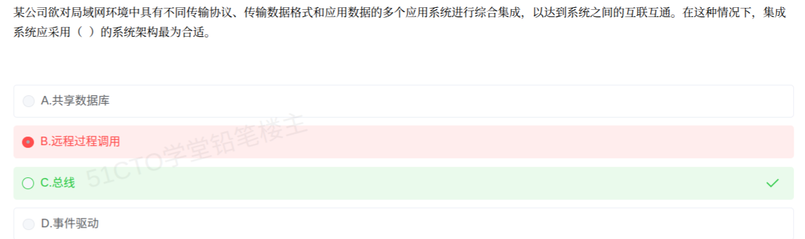

# 备考笔记：异构系统集成-总线架构选型

## 一、题目
> 某公司欲对局域网环境中具有不同传输协议、传输数据格式和应用数据的多个应用系统进行综合集成，以达到系统之间的互联互通。在这种情况下，集成系统应采用（ ）的系统架构最为合适。
> A. 共享数据库
> B. 远程过程调用
> C. 总线
> D. 事件驱动

**答案：C. 总线**

解析：题干关键词是"**不同传输协议、传输数据格式**"的多个异构系统要"综合集成、互联互通"——这正是总线架构（消息总线 / 企业服务总线 ESB）的核心职责：由总线集中承担**协议转换、数据格式转换、消息路由与服务编排**，各应用只需接入总线即可互联互通，耦合度低、扩展性好。共享数据库只能共享数据、解决不了协议差异且紧耦合；远程过程调用（RPC）是同步点对点调用，紧耦合且需逐对适配；事件驱动侧重异步发布/订阅的通知场景，而非异构协议/格式的转换集成。

## 二、知识点：异构系统集成-总线架构选型

### 1. 核心原理
总线架构是 EAI（企业应用集成）的典型方案：在局域网内架设一条（企业服务）总线作为所有应用系统的公共消息通道，各系统通过适配器接入总线。总线作为"中介者"集中完成：
- **协议转换**：屏蔽各系统底层传输协议差异（如 HTTP/MQ/JMS 等）
- **格式转换**：屏蔽数据表示差异（如 XML/JSON/EDI 之间互转）
- **消息路由**：按规则把消息从源系统送达目标系统
- **松耦合**：系统之间互不直接依赖，增删系统只影响自身与总线的接口

### 2. 关键公式/规则
| 名称 | 要点 |
| --- | --- |
| 总线方案适配 | 局域网 + 异构协议/格式 + 互联互通 → 总线 |
| 共享数据库适用 | 只做数据层面共享，需统一数据模型，紧耦合 |
| RPC 适用 | 同步、点对点紧耦合调用，接口需事先约定 |
| 事件驱动适用 | 异步发布/订阅、事件通知类场景 |
| 点对点集成代价 | n 个系统两两适配需 n(n-1)/2 个接口；总线方式每系统仅需 1 个总线接口 |

### 3. 解题步骤
1. 圈关键词："局域网环境""不同传输协议""不同传输数据格式""综合集成、互联互通" → 异构系统集成。
2. 排除法：共享数据库管不了协议/格式差异；RPC 同步紧耦合、逐对适配成本高（n² 级）。
3. 辨析总线 vs 事件驱动：题干强调的是"异构协议与格式的转换 + 综合集成"，不是"事件通知/发布订阅"，故选总线。
4. 记口诀：**异构集成找总线，协议格式它来变**。

## 三、易错点
1. 见到"松耦合、异步"就条件反射选"事件驱动"——只有题干落在**事件通知/发布订阅**语义时才选事件驱动；本题落在"协议与数据格式转换集成"，是总线的标志。
2. 误选"共享数据库"：数据集成 ≠ 系统集成，它不解决传输协议差异，且各系统共享同一数据模型属于紧耦合。
3. 误选"远程过程调用"：RPC 是同步调用机制，要求双方接口预先约定，n 个异构系统两两适配工作量爆炸。
4. 注意"局域网"限定词：软考中"局域网内异构系统集成 → 总线（ESB）"；跨广域网、跨企业的长语境才更多提示 SOA/Web 服务路线。

## 四、扩展延伸
- EAI 常见集成层次：**界面集成**（门户级）、**数据集成**（数据库级）、**API/控制集成**（函数/方法级）、**业务流程集成**（流程级），总线方案常同时承担后三者的消息中介。
- 总线与 SOA 的关系：ESB 是 SOA 的基础设施构件，可对照 [74-SOA服务建模-三阶段.md](74-SOA服务建模-三阶段.md) 复习；总线思想也呼应"中介者"模式（解耦多对象交互）。
- 事件驱动架构（EDA）与总线不矛盾：EDA 通常**基于**消息总线实现，但选型题看题干落点——"转换集成"选总线，"事件通知/实时响应"选事件驱动。
- 现实类比：总线像"国际会议的同声传译 + 消息收发室"，各代表（异构系统）只管发言/收件，翻译和路由交给总线。

## 五、错题归档
| 题号 | 题型 | 考点 | 难度 | 掌握度 |
| --- | --- | --- | --- | --- |
| 待补 | 单选 | EAI 异构系统集成架构选型（总线 vs 共享库/RPC/事件驱动） | 中 | 薄弱 |

## 六、相关图片
原题截图：`../images/75-异构系统集成-总线架构选型.png`（由用户上传的原题图复制改名而来）

