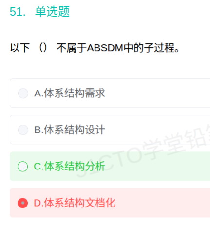

# 备考笔记：ABSDM-六个子过程辨析

## 一、题目
> 以下（ ）不属于 ABSDM 中的子过程。
> A. 体系结构需求
> B. 体系结构设计
> C. 体系结构分析
> D. 体系结构文档化

**答案：C. 体系结构分析**

解析：ABSDM（基于体系结构的软件开发模型）以体系结构为中心，把开发过程划分为**六个子过程：体系结构需求 → 体系结构设计 → 体系结构文档化 → 体系结构复审 → 体系结构实现 → 体系结构演化**。"体系结构分析"不在其中，故选 C。

## 二、知识点：ABSDM-六个子过程辨析

### 1. 核心原理
ABSDM（Architecture-Based Software Development Model，基于体系结构的软件开发模型）主张整个软件生命周期以**软件体系结构为核心**，开发过程被切分为六个子过程，形成"需求→设计→文档→复审→实现→演化"的闭环；需求变化时通过"演化"子过程回到设计，迭代推进。

### 2. 关键规则（六子过程及要点）
| 顺序 | 子过程 | 要点 |
| --- | --- | --- |
| 1 | 体系结构需求 | 获取并整理对体系结构的需求（质量属性驱动） |
| 2 | 体系结构设计 | 产出候选/目标体系结构方案 |
| 3 | 体系结构文档化 | 产出**体系结构规格说明**，便于交流与实现 |
| 4 | 体系结构复审 | 早期发现设计缺陷，防止后期成本放大 |
| 5 | 体系结构实现 | 依据体系结构进行构件开发与组装 |
| 6 | 体系结构演化 | 需求变化时对体系结构进行调整演化 |

记忆口诀：**需 → 设 → 文 → 复 → 实 → 演**（谐音："需设文复实演"）。

### 3. 解题步骤
1. 默写六子过程口诀"需设文复实演"。
2. 逐项对号：A 需求✔、B 设计✔、D 文档化✔。
3. C"分析"不在清单中 → 选 C。
4. 变式题同理：出现"体系结构评估/分析/测试/集成"等非清单词汇，即为"不属于"项。

## 三、易错点
1. 把"体系结构分析"当成设计前的正常环节而误选 → 教材清单里没有"分析"这一子过程。
2. 与**架构评估方法**（SAAM、ATAM、CBAM）混淆：评估是"体系结构复审"中常用的技术手段，不是子过程名。
3. 与 DSSA（特定领域软件体系结构）的领域分析等活动混淆：DSSA 有"领域分析"，ABSDM 没有"体系结构分析"。
4. 漏掉"体系结构演化"或"复审" → 填空/多选变式中常挖这两个空。

## 四、扩展延伸
- ABSDM 与 ABSD 的关系：ABSD（基于体系结构的设计方法）是设计方法本身，ABSDM 是把 ABSD 贯穿到整个软件开发生命周期后形成的**模型**，六个子过程即其生命周期划分。
- 体系结构复审常采用第三方的**架构评估**：ATAM（架构权衡分析法）、SAAM（场景分析法）、CBAM（成本效益分析法）——评估类知识点见后续笔记。
- 相关笔记：[79-4+1视图模型-五视图职责辨析](79-4+1视图模型-五视图职责辨析.md)（体系结构描述）。

## 五、错题归档
| 题号 | 题型 | 考点 | 难度 | 掌握度 |
| --- | --- | --- | --- | --- |
| 51 | 单选-选不属于项 | ABSDM 六个子过程（"体系结构分析"不在其中） | 易 | 薄弱 |
| 重做 1 | 单选-选不属于项 | 同上 | 易 | 重做 1-误选 D |

## 六、相关图片
原题截图：`../images/83-ABSDM-六个子过程辨析.png`（由用户上传的原题图复制改名而来）

