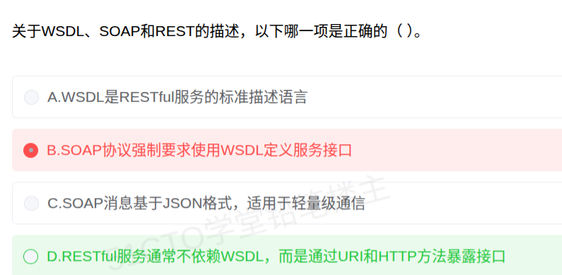

# 备考笔记：WSDL-SOAP-REST关系辨析

## 一、题目
> 关于 WSDL、SOAP 和 REST 的描述，以下哪一项是正确的（ ）。
> A. WSDL 是 RESTful 服务的标准描述语言
> B. SOAP 协议强制要求使用 WSDL 定义服务接口
> C. SOAP 消息基于 JSON 格式，适用于轻量级通信
> D. RESTful 服务通常不依赖 WSDL，而是通过 URI 和 HTTP 方法暴露接口

**答案：D. RESTful 服务通常不依赖 WSDL，而是通过 URI 和 HTTP 方法暴露接口**

解析：REST 以"资源 URI + 统一接口（GET/POST/PUT/DELETE）"暴露服务，一般不需要 WSDL 这类机器可读契约。A 错——WSDL 是**传统 Web 服务（SOAP）**的描述语言，RESTful 服务多用 WADL/OpenAPI(Swagger)；B 错——SOAP 与 WSDL 是"常用搭配"而非强制绑定，SOAP 是 XML 消息协议，WSDL 是独立的描述标准；C 错——SOAP 消息基于 **XML** 而非 JSON，基于 JSON 轻量通信是 REST 的典型特征。

## 二、知识点：WSDL-SOAP-REST关系辨析

### 1. 核心原理
传统 Web 服务三件套 = **SOAP（消息协议）+ WSDL（服务描述）+ UDDI（注册发现）**，三者是独立标准、按需组合：SOAP 用 XML 信封传消息，WSDL 用 XML 描述接口（portType/operation/message/binding/service），UDDI 做注册中心。REST 则不依赖重契约，直接用 **URI 标识资源 + HTTP 动词作统一接口**，靠约定而非描述语言暴露服务。

### 2. 关键规则（四者职责对照）
| 标准/风格 | 本质 | 格式 | 关键词 |
| --- | --- | --- | --- |
| SOAP | XML 消息协议（Envelope/Header/Body） | XML | 消息传输、可配 WS-Security 等企业级扩展 |
| WSDL | 服务接口描述语言（给 SOAP 服务） | XML | 描述"有什么操作、怎么调用"；REST 不用它 |
| UDDI | 服务注册与发现（服务代理） | XML | 注册中心查找服务；REST 无需 |
| REST | 架构风格 | 任意（常 JSON） | 资源 URI + HTTP 动词统一接口、无状态、缓存 |

### 3. 解题步骤
1. 抓"格式"关键词：SOAP/WSDL/UDDI 全是 **XML** 系；JSON 轻量 → REST（选项 C 排除）。
2. 抓"归属"：WSDL 描述的是 **SOAP/传统 Web 服务**，不是 RESTful（选项 A 排除）。
3. 抓"绑定强度"：SOAP 与 WSDL 是**事实上的常用组合**，但两者为独立标准，"强制要求"表述即错（选项 B 排除）。
4. REST 的暴露方式 = URI + HTTP 方法 → D 正确。

## 三、易错点
1. 把"WSDL 常用于 SOAP 服务"记成"SOAP 强制 WSDL" → 二者是独立标准的经典搭配，无强制关系（本题 B 即此坑）。
2. 误认为 REST 也用 WSDL 描述 → REST 通常不依赖 WSDL；其描述工具是 WADL / OpenAPI(Swagger)，且非强制。
3. 把"基于 JSON 轻量通信"安到 SOAP 头上 → SOAP 消息是 XML 信封；JSON 是 REST 常用表述格式。
4. 与笔记 82 的"服务代理"坑联动：UDDI 注册中心属于传统 Web 服务体系，REST 不需要。

## 四、扩展延伸
- WSDL 文档骨架：types → message → portType（抽象接口）→ binding（协议绑定）→ service/port（端点地址），单选常考"portType 是抽象操作集合"。
- SOAP 消息结构：必选 **Envelope** 根元素、可选 **Header**（头扩展，如事务/安全）、必选 **Body**（有效载荷）、可选 Fault（错误报告）。
- REST 描述标准演进：WADL → OpenAPI（Swagger）→ 与题干"通常不依赖"一致：约定优于契约。
- 关联笔记：[82-REST-优点与服务代理陷阱](82-REST-优点与服务代理陷阱.md)（无需服务代理/UDDI 的发现方式）、[80-SOA-ESB总线分层与职责](80-SOA-ESB总线分层与职责.md)。

## 五、错题归档
| 题号 | 题型 | 考点 | 难度 | 掌握度 |
| --- | --- | --- | --- | --- |
| — | 单选-选正确项 | SOAP/WSDL/UDDI 与 REST 的职责与绑定关系（WSDL 归属、SOAP 用 XML、"强制"陷阱） | 中 | 薄弱 |

## 六、相关图片
原题截图：`../images/84-WSDL-SOAP-REST关系辨析.png`（由用户上传的原题图复制改名而来）

