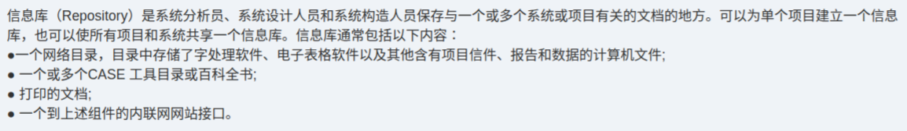

# 备考笔记：信息库Repository-构成内容

## 一、题目
> 信息库（Repository）是系统分析员、系统设计人员和系统构造人员保存与一个或多个系统或项目有关的文档的地方。可以为单个项目建立一个信息库，也可以使所有项目和系统共享一个信息库。信息库通常包括以下内容：
> - 一个网络目录，目录中存储了字处理软件、电子表格软件以及其他含有项目信件、报告和数据的计算机文件；
> - 一个或多个 CASE 工具目录或百科全书；
> - 打印的文档；
> - 一个到上述组件的内联网网站接口。

**答案（知识要点）：信息库的四类构成 = 网络目录 + CASE 工具目录/百科全书 + 打印的文档 + 内联网网站接口。** 本图为教材原文型知识点，常以"下列哪些属于信息库的内容 / 关于信息库的叙述错误的是"形式命题，按四类构成逐项比对即可。

## 二、知识点：信息库Repository-构成内容

### 1. 核心原理
信息库（Repository，又译"中心库/资源库"）是**系统分析员、系统设计人员和系统构造人员**保存与一个或多个系统或项目有关的**文档**的地方。其组织方式有两种：
- **单项目库**：为单个项目建立一个信息库；
- **共享库**：所有项目和系统共享一个信息库。

信息库的本质是为系统开发全过程提供**统一的文档与工具资产存储、共享与访问机制**，是 CASE（计算机辅助软件工程）环境的组成要素之一。

### 2. 关键公式/规则

| 名称 | 内容 |
| --- | --- |
| 构成① | 一个**网络目录**：存储字处理软件、电子表格软件以及其他含有项目信件、报告和数据的计算机文件 |
| 构成② | 一个或多个 **CASE 工具目录或百科全书**（ encyclopedia ） |
| 构成③ | **打印的文档**（纸质文档） |
| 构成④ | 一个到上述组件的**内联网网站接口**（统一访问入口） |

### 3. 解题步骤
1. 抓定义主语：信息库服务对象 = 系统分析员、系统设计人员、系统构造人员；存储对象 = 与系统/项目有关的**文档**。
2. 记忆四类构成关键词：**网目录、CASE 库、纸质档、内联网口**。
3. 遇"属于/不属于信息库内容"题，将选项与四类构成比对；与"数据库、数据仓库"区分——信息库存的是**开发文档与项目资产**，不是业务运行数据。

## 三、易错点
1. **混淆信息库与数据库/数据仓库**：信息库面向**系统开发过程**（文档、CASE 工具产物），不是存放企业业务数据的运行库。
2. 漏掉"**打印的文档**"：信息库不只含电子资源，也包含纸质文档。
3. 漏掉"**内联网网站接口**"：接口本身也是信息库的组成部分，它是访问前述组件的统一入口。
4. 误以为信息库只能为单个项目建立——原文明确"可以为单个项目建立，也可以所有项目和系统共享"。

## 四、扩展延伸
- **信息库 vs 数据仓库**：数据仓库面向决策分析（主题导向、随时间变化、只增不改）；信息库面向开发过程的文档资产管理。
- **CASE 百科全书（encyclopedia）**：CASE 工具目录/百科全书是信息库的核心构件，存放分析设计模型（数据流图、E-R 图等）的元数据。
- 与本笔记相关的既有条目：44-信息工程方法论-以数据为中心、45-信息工程四阶段-信息规划（信息工程方法论同样强调以数据/存储为中心组织开发）。

## 五、错题归档
| 题号 | 题型 | 考点 | 难度 | 掌握度 |
| --- | --- | --- | --- | --- |
| — | 知识点原文 | 信息库（Repository）的定义与四类构成内容 | 易 | 待复习 |

## 六、相关图片
原题截图：`../images/86-信息库Repository-构成内容.png`（由用户上传的原题图复制改名而来）

