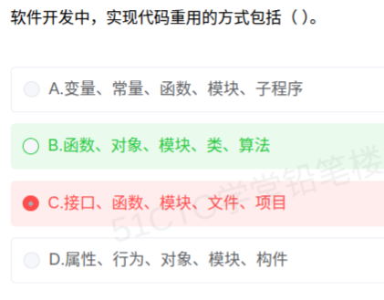

# 备考笔记：代码重用方式辨析

## 一、题目
> 软件开发中，实现代码重用的方式包括（）。
> A. 变量、常量、函数、模块、子程序
> B. 函数、对象、模块、类、算法
> C. 接口、函数、模块、文件、项目
> D. 属性、行为、对象、模块、构件

**答案：B. 函数、对象、模块、类、算法**

## 二、知识点：代码重用方式辨析

### 1. 核心原理
代码重用（复用）是指在同一或不同项目中**重复使用已有代码资产**以降低开发成本、提高质量。判断某事物是否为"重用方式"的标准：**它是否是一种可被多次调用/复制的代码组织与抽象形态**。
- **是重用方式**：函数/子程序（过程级复用）、类与对象（面向对象复用）、模块（逻辑组装复用）、算法（思想级复用）、构件/组件（系统级复用，教材亦承认）。
- **不是重用方式**：变量、常量（数据元素，不构成可复用逻辑单元）；文件、项目（物理存储/管理单元，与代码抽象级别无关）；属性、行为（对象的内部组成成分，本身不是复用单元）。

### 2. 关键公式/规则

| 名称 | 内容 |
| --- | --- |
| 判定标准 | 能否作为**独立的逻辑/抽象单元被多次调用或嵌入** |
| 典型重用级别 | 算法（思想级）→ 函数/子程序（过程级）→ 类/对象（OO 级）→ 模块 → 构件（系统级） |
| 干扰项特征 | 变量/常量＝数据元素；文件/项目＝存储组织单元；属性/行为＝对象内部成分 |

### 3. 解题步骤
1. 逐项扫描选项中的每个名词，问"它是不是可被复用的代码单元"。
2. 只要选项中出现**变量、常量、文件、项目、属性、行为**等非重用单元，立即排除该选项。
3. 剩余选项中全部由函数、对象、类、模块、算法、构件等构成的即为答案（本题 B）。

## 三、易错点
1. **误选 C 的原因**：看到"接口、函数、模块"都眼熟，忽略**文件、项目**只是物理组织单位，不是重用方式。
2. 看到 D 中的"构件"是重用单元就放松警惕——D 中**属性、行为**是对象的组成成分，不能单独构成重用方式。
3. A 中"函数、模块、子程序"没问题，但**变量、常量**是数据元素，排除 A。
4. 逐词排除法是关键：四个选项各埋 2 个干扰词，**抓毒点**比抓正确点更快。

## 四、扩展延伸
- 软件复用广义上还包括：需求复用、设计模式复用、构件复用、框架复用、服务复用（SOA）等更高层次。
- 构件（Component）复用是系统级重用的代表：独立交付、接口契约、可组装（参见 22-构件接口不兼容的常见问题）。
- 类库/函数库、设计模式、框架是面向对象复用的三种典型形式。

## 五、错题归档
| 题号 | 题型 | 考点 | 难度 | 掌握度 |
| --- | --- | --- | --- | --- |
| — | 单选 | 代码重用方式的判定（排除非重用单元） | 易 | 薄弱 |
| 重做 1 | 单选 | 同上 | 易 | 重做 1-误选 C |

## 六、相关图片
原题截图：`../images/87-代码重用方式辨析.png`（由用户上传的原题图复制改名而来）

