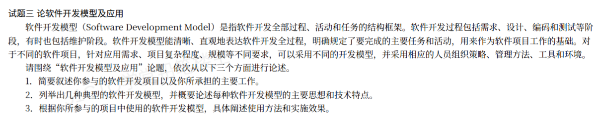

# 备考笔记：软件开发模型及其应用（论文写作要点）

## 一、题目

> **试题三 论软件开发模型及应用**
>
> 软件开发模型（Software Development Model）是指软件开发全部过程、活动和任务的结构框架。软件开发过程包括需求、设计、编码和测试等阶段，有时也包括维护阶段。软件开发模型能清晰、直观地表达软件开发全过程，明确规定了要完成的主要任务和活动，用来作为软件项目工作的基础。对于不同的软件项目，针对应用需求、项目复杂程度、规模等不同要求，可以采用不同的开发模型，并采用相应的人员组织策略、管理方法、工具和环境。
>
> 请围绕"软件开发模型及应用"论题，依次从以下三个方面进行论述。
>
> 1. 简要叙述你参与的软件开发项目以及你所承担的主要工作。
> 2. 列举出几种典型的软件开发模型，并概要论述每种软件开发模型的主要思想和技术特点。
> 3. 根据你所参与的项目中使用的软件开发模型，具体阐述使用方法和实施效果。

**答案：论文题（无标准选项）——按"项目背景 → 理论论述 → 项目实践"三段结构作答，核心采分点为：①项目背景与本人工作；②若干典型开发模型的主要思想与技术特点；③本项目选用模型的使用方法与实施效果。**

解析：第 2 问是**理论主体**，必须**列举多种模型**并逐个讲"主要思想 + 技术特点"，只写一两种会明显失分；第 3 问是**实践论证**，必须**落到本项目**——说明为什么选这个模型、怎么用、效果如何。评分看"**理论准确性 + 项目真实性 + 结合紧密度**"。

## 二、知识点：软件开发模型

### 1. 核心原理

**软件开发模型** = 软件开发**全部过程、活动和任务的结构框架**。它回答三个问题：**先做什么（阶段划分）、每阶段产出什么（任务与交付物）、阶段之间怎么衔接（推进方式）**。

三个要点：

1. 模型是**框架**，不是具体技术——它规定"工作怎么组织"，不规定"代码怎么写"。
2. 模型是**选择**出来的——不同项目按**需求明确程度、复杂程度、规模、风险高低**选不同模型，并配套相应的人员组织、管理方法、工具与环境。
3. 模型可以**组合使用**——实际项目常"主模型 + 辅助实践"混用（如增量 + 敏捷、瀑布 + 原型）。

### 2. 关键公式/规则：典型软件开发模型清单

| 模型 | 主要思想 | 技术特点 | 适用场景 |
| --- | --- | --- | --- |
| **瀑布模型（Waterfall）** | 严格按阶段**线性推进**：需求→设计→编码→测试→维护，前一阶段完成并评审通过后才进入下一阶段 | 阶段顺序固定、文档驱动、里程碑清晰；**后一阶段才暴露问题，返工代价大** | 需求**明确且稳定**、技术成熟、规模可控的项目 |
| **原型模型（Prototype）** | 先做一个**可运行的简化版本（原型）**给用户看，据此澄清需求，再正式开发 | 快速构建、用户参与早、需求反馈快；原型可能被丢原型（抛弃型）或演进为产品（演化型） | 需求**不明确**、用户说不清想要什么 |
| **增量模型（Incremental）** | 把系统按功能切成若干**增量**，每个增量都**完整地走一遍开发流程**，逐个交付、逐步累加 | 交付早、可分批上线、风险分摊；**要求系统架构可增量扩展** | 需求可分块、能分批交付、希望早见成果 |
| **螺旋模型（Spiral）** | 以**原型 + 瀑布**为基础，按"**螺旋**"反复迭代，每一圈都做四步：**制定计划 → 风险分析 → 实施工程 → 客户评估** | **以风险分析为核心驱动**、迭代演进、每圈产出一个可评估版本 | **大型、高风险**项目（教材常以此区别于其他模型） |
| **喷泉模型（Fountain）** | 面向对象开发的**迭代、无间隙**过程，各阶段（分析/设计/实现）**相互重叠、可反复回溯** | 阶段边界模糊、可重复迭代、支持面向对象复用 | 面向对象、需求逐渐清晰的迭代式开发 |
| **变换模型（Transformational）** | 先写**形式化规格说明**，再通过**变换/推导**把规格逐步变成程序，正确性可验证 | 基于形式化方法、以自动变换为主、强调**正确性证明** | 高可靠性、形式化可描述的系统 |
| **V 模型（V-Model）** | 把开发与测试**对称对应**：需求↔验收测试、设计↔集成/系统测试、编码↔单元测试 | 强调**测试与开发同步规划**，左侧每层都有右侧验证对应 | 强调验证与质量、对测试有严格要求的项目 |
| **RUP（统一过程）** | 以**用例驱动、架构为中心、迭代增量**为核心，分四阶段（初始、细化、构造、移交），每个阶段含多个迭代 | 用例驱动、架构为中心、迭代增量、可裁剪；配合 UML 与工件集 | 中大型、面向对象、需求可逐步细化 |
| **敏捷/敏捷开发（Agile）** | 以**可工作的软件**和**客户合作**为中心，短迭代、小步快跑、响应变化 | 迭代短（1~4 周）、持续交付、拥抱变化、自组织团队；含 XP、Scrum、Crystal、DSDM 等 | 需求**快速变化**、规模适中、团队能近距离协作 |

> 记忆抓手：**瀑布线性、原型试错、增量累加、螺旋防险、喷泉回溯、变换证明、V 型配对、RUP 迭代、敏捷应变**。

**模型选型的一句话判据**（第 3 问"为什么选它"用得上）：

- 需求**稳定明确** → 瀑布；
- 需求**说不清** → 原型；
- 要**早交付/分批上线** → 增量；
- **风险大、规模大** → 螺旋；
- **面向对象迭代** → 喷泉 / RUP；
- 要**可验证正确性** → 变换；
- **重视测试与质量** → V 模型；
- 需求**变化快** → 敏捷。

### 3. 解题步骤（论文作答框架）

1. **摘要**：项目背景一句话 + 我的角色 + 本文论述的三点 + 效果。
2. **第 1 问（项目背景）**：选一个**真实、可讲清**的项目——名称、规模、业务与技术栈、我的岗位与职责。**要点到具体**，忌空泛。
3. **第 2 问（理论）**：**列举多种典型模型**，每个模型写"**主要思想 + 技术特点 + 适用场景**"三要素。推荐至少写 **4~6 种**（瀑布、原型、增量、螺旋、喷泉/变换、V 模型、RUP、敏捷中挑），并点明它们"解决不同问题"的差异。**不要只写一两种**。
4. **第 3 问（结合项目）**：把理论**映射到本项目**——
   - **为什么选**：结合项目需求/风险/规模，说明选型理由；
   - **怎么用**：写出该模型在本项目的落地做法（阶段划分、迭代周期、每轮交付物、评审与角色分工），可用**主模型 + 辅助实践**（如 RUP + 敏捷实践）；
   - **实施效果**：用**量化数据**收尾（交付周期、缺陷率、需求变更响应时间、按期上线率）。
5. **收尾**：总结效果 + 不足与改进方向（**留一句反思**是高分特征）。

## 三、易错点

1. **第 2 问只写一两个模型**：题干明确要求"**列举出几种**"，模型数量不足是硬伤。建议写 4~6 种，并覆盖"线性类 + 迭代类 + 风险类 + 敏捷类"。
2. **只讲思想、不讲技术特点**：题干要的是"**主要思想和技术特点**"两部分。比如瀑布的"特点"是**阶段顺序固定、文档驱动、返工代价大**，只写"按阶段推进"不够。
3. **模型张冠李戴**：最易混的是——
   - **螺旋 vs 增量**：螺旋以**风险分析**为核心、每圈四步；增量以**功能分块**为核心、每块走完整流程。**"高风险项目"必选螺旋**（见 [43-开发过程模型选型-高风险项目螺旋模型.md](43-开发过程模型选型-高风险项目螺旋模型.md)）。
   - **原型 vs 增量**：原型目的是**澄清需求**，可能被丢弃；增量目的是**分批交付功能**。
   - **V 模型 vs 瀑布**：V 模型强调**开发与测试的对应关系**，瀑布强调**阶段线性推进**。
4. **第 3 问与第 2 问脱节**：第 3 问必须用**第 2 问讲过的模型**去套本项目。若第 2 问写了螺旋、第 3 问却说用瀑布，逻辑自相矛盾，严重失分。
5. **只讲理论不结合项目**：通篇教材语言、没有项目细节与数据，直接判为**未结合实践**。
6. **缺量化效果**：第 3 问要求"**实施效果**"，务必给出**前后对比数据**（如"迭代周期从 6 周缩短到 2 周""系统上线后缺陷率下降 X%"）。
7. **变量名/概念前后不一致**：论文里同一概念始终用同一名称（本篇自定义指令也强调这点）。例如统一用"增量模型"，不要一会"增量"一会"渐增"。

## 四、扩展延伸

- **模型演进主线**：**瀑布（线性）→ 原型/增量（缓解返工与早交付）→ 螺旋（加入风险驱动）→ 喷泉/RUP（面向对象迭代）→ 敏捷（响应变化）**。这条主线本身就是第 2 问的答题逻辑：**模型在解决前一代模型的痛点**。
- **三个"面向对象迭代"模型的关系**：喷泉、螺旋、RUP 都强调迭代，但侧重点不同——喷泉强调**阶段无间隙重叠**，螺旋强调**风险**，RUP 强调**用例驱动 + 架构为中心**。
- **敏捷家族**：XP（极限编程，实践最强）、Scrum（管理框架最强）、Crystal（按规模裁剪）、DSDM（动态系统开发方法）、FDD（特征驱动）、ASD（自适应）。详见 [93-敏捷开发-基本原则与实践.md](93-敏捷开发-基本原则与实践.md)。
- **RUP 四阶段与核心**：初始（确定范围与可行性）→ 细化（确定架构）→ 构造（实现）→ 移交（交付）；三大核心是**用例驱动、架构为中心、迭代增量**（见 [74-SOA服务建模-三阶段.md](74-SOA服务建模-三阶段.md) 对比记忆"防混淆"）。
- **论文得分要点（通用）**：**摘要简洁有力（约 300 字）、正文分点分段、理论与实践一一对应、有数据、有反思**。避免大段背诵教材、避免与题干无关的堆砌。
- **现实类比**：**瀑布**＝按图纸盖楼（先定稿再动工）；**原型**＝先做样板间让客户提意见；**增量**＝一层层交付、住一层交一层；**螺旋**＝先做风险评估再逐圈推进；**敏捷**＝边住边改、小步快跑。

## 五、错题归档

| 题号 | 题型 | 考点 | 难度 | 掌握度 |
| --- | --- | --- | --- | --- |
| 系统分析师-软件开发模型 | 论文 | 典型开发模型清单（瀑布/原型/增量/螺旋/喷泉/变换/V/RUP/敏捷）的**主要思想与技术特点** | 中 | 待复习 |
| 系统分析师-软件开发模型 | 论文 | 结合项目论述**模型选型理由、使用方法与量化实施效果** | 中 | 待复习 |
| 系统分析师-软件开发模型 | 单选 | 螺旋模型适用于高风险项目（第 43 篇） | 易 | 待复习 |

## 六、相关图片

原题截图：`../images/90-软件开发模型-论文写作要点.png`（由用户上传的原题图复制改名而来）

## 七、范文附录：论软件开发模型及应用

> 说明：以下为按本题三段框架撰写的完整论文范文（约 2500 字），可直接作为考场仿写模板。第 2 问务必**列举多种模型并逐个讲思想与特点**；第 3 问务必**落到本项目的选型理由、使用方法与量化效果**；结尾留一句**不足与改进**。

### 摘要

2023 年 4 月，我参与了某省属高校"智慧校园一体化服务平台"的建设工作，担任项目经理兼系统分析师，全面负责项目的开发组织与管理。该平台面向全校 3 万余名师生，整合教务、学工、后勤、一卡通等业务，需求复杂且各院系诉求差异较大。本文结合该项目，首先简述了项目背景与本人承担的主要工作；其次列举了瀑布、原型、增量、螺旋、RUP、敏捷等几种典型软件开发模型，概要论述了各自的主要思想和技术特点；最后结合项目实践，说明了本项目采用"统一过程（RUP）为主、敏捷实践为辅"的选型理由、使用方法及实施效果。项目最终按期上线，主要业务上线周期由 6 个月缩短至 3 个月，需求变更响应时间显著下降，取得了良好的应用效果。

### 一、项目背景及本人承担的主要工作

2023 年 4 月，我所在单位承接了某省属高校"智慧校园一体化服务平台"建设项目。该高校原有多套业务系统各自独立建设，存在数据不通、入口分散、师生需多账号登录等问题。新平台旨在实现"统一门户、统一身份、统一数据、统一服务"，覆盖教务管理、学生工作、后勤服务、一卡通、消息通知等业务，服务对象为全校 3 万余名师生与 2000 余名教职工。

平台采用前后端分离的微服务架构，后端基于 Spring Cloud 构建，划分为统一认证、教务服务、学工服务、后勤服务、消息中心、数据中台等 9 个微服务；数据层采用 MySQL 集群存储业务数据，Redis 缓存会话与热点数据，通过数据中台完成异构系统的数据汇聚与共享；前端采用 Vue 构建统一门户，部署于 Kubernetes 容器平台。项目周期 12 个月，团队规模约 20 人（开发 12 人、测试 4 人、运维 2 人、业务 2 人）。

在该项目中，我担任项目经理兼系统分析师，主要工作包括：一是组织需求调研，梳理各院系业务诉求并确定平台总体功能范围；二是负责软件过程模型的选型与裁剪，制定项目开发计划与迭代节奏；三是组织架构设计评审、迭代计划评审与阶段验收；四是统筹进度、质量与风险管理，协调校方业务部门与开发团队的沟通。项目于 2024 年 3 月按期上线，目前运行平稳。

### 二、几种典型的软件开发模型

在信息系统建设中，常见的软件开发模型有以下几种，它们的主要思想和技术特点各不相同。

**1. 瀑布模型。** 其思想是把开发严格划分为需求、设计、编码、测试、维护等阶段，按线性顺序推进，前一阶段评审通过后才进入下一阶段。技术特点是**阶段顺序固定、文档驱动、里程碑清晰、便于管理**，但**问题暴露晚、返工代价大**，适用于需求明确且稳定的项目。

**2. 原型模型。** 其思想是先快速构建一个可运行的简化版本（原型）交给用户试用，据此澄清和确认需求，再正式开发。技术特点是**用户参与早、需求反馈快**，原型可分为抛弃型和演化型，适用于需求不明确、用户难以一次说清的场景。

**3. 增量模型。** 其思想是把系统按功能划分为若干增量，每个增量都完整地经历一轮开发流程并交付，功能逐步累加。技术特点是**交付早、可分批上线、风险分摊**，但要求系统架构具备良好的可扩展性，适用于需求可分解、希望尽快见到成果的项目。

**4. 螺旋模型。** 其思想是在原型与瀑布的基础上引入**风险分析**，将开发组织为多圈螺旋，每一圈包含**制定计划、风险分析、实施工程、客户评估**四个步骤，逐圈推进。技术特点是**以风险分析为核心驱动、迭代演进、每圈都产出可评估版本**，特别适用于**大型、高风险**项目。

**5. 喷泉模型。** 其思想是面向对象开发过程中的各阶段并非严格分离，而是**相互重叠、可反复回溯**，如同喷泉的水流上下往复。技术特点是**阶段边界模糊、支持迭代与复用**，适用于面向对象、需求逐步清晰的迭代式开发。

**6. V 模型。** 其思想是把开发与测试**对称对应**：需求分析对应验收测试、概要设计对应系统测试、详细设计对应集成测试、编码对应单元测试。技术特点是**强调测试与开发同步规划、验证与确认并重**，适用于对质量与验证要求严格的项目。

**7. RUP（统一过程）。** 其思想是以**用例驱动、架构为中心、迭代增量**三大原则组织开发，划分为初始、细化、构造、移交四个阶段，每个阶段包含一至多个迭代。技术特点是**用例驱动需求、架构先行、迭代可控、过程可裁剪**，配合 UML 建模，适用于中大型面向对象项目。

**8. 敏捷开发。** 其思想是强调个体与互动、可工作的软件、客户合作和响应变化，通过短周期迭代持续交付可用的软件。技术特点包括**迭代周期短（1~4 周）、持续交付、拥抱需求变化、团队自组织**，代表方法有极限编程（XP）、Scrum、Crystal、DSDM 等，适用于需求快速变化、规模适中的项目。

综上可见，这些模型并无绝对优劣之分——**瀑布强调规范、原型强调澄清、增量强调早交付、螺旋强调控风险、RUP 强调迭代与架构、敏捷强调应变**，应根据项目特点选择与组合。

### 三、结合项目论述模型的使用

#### （一）模型选型理由

本项目具有三个突出特点：**一是需求复杂且不完全清晰**，各院系诉求差异大、初始阶段难以一次确定；**二是系统规模较大、架构要求高**，涉及 9 个微服务与异构数据整合；**三是存在进度压力**，校方要求当年完成主要业务上线。综合权衡后，我们没有照搬单一模型，而是采用"**统一过程（RUP）为主、敏捷实践为辅**"的组合方案：以 RUP 的**用例驱动、架构为中心、迭代增量**保证大型系统的架构质量与需求可追溯；同时借鉴敏捷的**短迭代、每日站会、持续集成**提高响应速度。

之所以不选瀑布，是因为需求不稳定、返工风险高；不选纯螺旋，是因为项目虽有一定风险，但并非技术探索型项目，用重风险模型成本过高；选择 RUP 正是看中它**既能像瀑布一样有清晰阶段，又能像敏捷一样迭代交付**的折中特性。

#### （二）使用方法

**一是按 RUP 四阶段推进。** 初始阶段完成项目范围、干系人和可行性分析，产出《项目愿景与范围说明》；细化阶段完成需求用例模型与总体架构设计，产出《软件架构文档》并通过评审；构造阶段分三个迭代完成各微服务开发；移交阶段完成集成测试、用户培训与上线。

**二是以用例驱动需求。** 我们梳理出 120 余个用例，按业务价值与优先级排序，形成迭代待办清单，确保每个迭代交付的都是用户真正需要的高优先级功能。

**三是架构先行。** 在细化阶段即确定微服务拆分、统一认证与数据中台方案，先行搭建统一认证与数据中台两个基础服务作为架构基线，后续业务服务在此基础上扩展，避免了架构返工。

**四是引入敏捷实践辅助。** 构造阶段采用 **2 周一个迭代**，每个迭代召开计划会与评审会、每日站会同步进度；引入**持续集成**（Jenkins + 自动化测试），每日构建并回归；需求变更通过迭代待办清单统一管理，小变更纳入下一迭代，重大变更走变更评审。

**五是迭代评审与风险管理并行。** 每个迭代结束组织演示与评审，及时纠偏；同时建立风险清单，对"数据迁移质量""第三方接口不可控"等风险提前制定预案。

#### （三）实施效果

通过上述方法与组合实践，项目取得了明显效果：**一是交付更快**，教务、学工等主要业务上线周期由原计划的 6 个月缩短至 3 个月，实现分批上线；**二是质量更稳**，借助持续集成与自动化回归，上线后严重缺陷较同类项目下降约 40%，未发生重大生产事故；**三是应变更强**，需求变更响应时间由平均 2 周缩短至 3 天以内，多个院系的个性化诉求在迭代中快速落地；**四是用户更满意**，统一门户与统一认证使师生只需一次登录即可访问全部业务，校方对项目成果给予高度评价。

### 四、总结

本文结合"智慧校园一体化服务平台"项目，首先简述了项目背景与本人工作，其次列举了瀑布、原型、增量、螺旋、喷泉、V 模型、RUP、敏捷等典型软件开发模型的主要思想与技术特点，最后论述了本项目采用"RUP 为主、敏捷为辅"组合模型的选型理由、使用方法与实施效果。实践证明，**开发模型没有最优、只有最合适，组合与裁剪往往比生搬硬套更有效**。不足之处在于，本项目对敏捷实践的应用仍偏保守，部分迭代的自动化测试覆盖不足，后续将进一步提升自动化与度量水平，使迭代节奏更加稳健。
