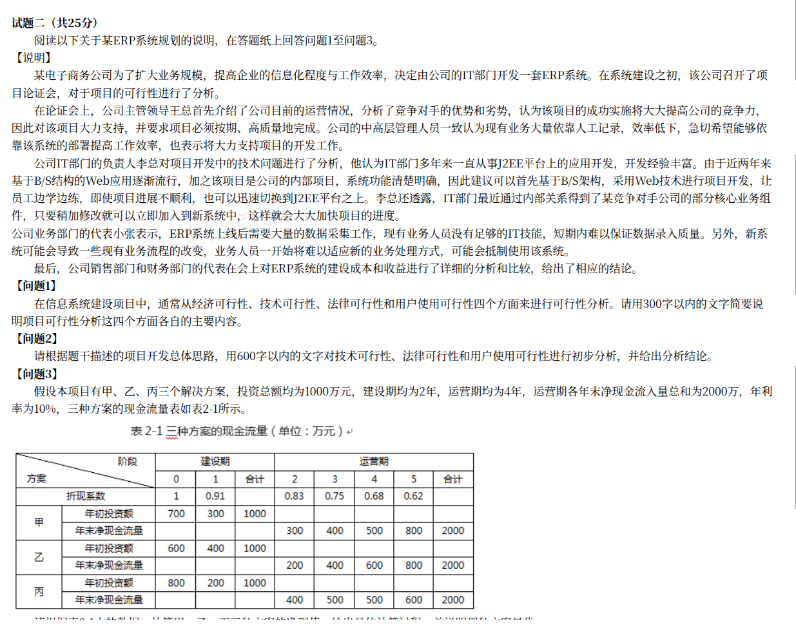

# 备考笔记：系统规划-可行性分析与投资决策计算

## 一、题目

> **试题二（共 25 分）阅读以下关于某 ERP 系统规划的说明，在答题纸上回答问题 1 至问题 3。**
>
> **【说明】** 某电子商务公司为了扩大业务规模，提高企业的信息化程度与工作效率，决定由公司的 IT 部门开发一套 ERP 系统。在系统建设之初，该公司召开了项目论证会，对于项目的可行性进行了分析。
>
> 在论证会上，公司主管领导王总首先介绍了公司目前的运营情况，分析了竞争对手的优势和劣势，认为该项目的成功实施将大大提高公司的竞争力，因此对本项目大力支持，并要求项目必须按期、高质量地完成。公司的中高层管理人员一致认为现有业务大量依赖人工记录，效率低下，急切希望能够依靠该系统的部署提高工作效率，也表示将大力支持项目的开发工作。
>
> 公司 IT 部门的负责人李总对项目开发中的技术问题进行了分析。他认为 IT 部门多年来一直从事 J2EE 平台上的应用开发，开发经验丰富。加之近两年基于 B/S 结构的 Web 应用逐渐流行，且该项目是公司的内部项目，系统功能清楚明确，因此建议首先基于 B/S 架构，采用 Web 技术进行项目开发，让员工边学边练，即使项目进展不顺利，也可以迅速切换到 J2EE 平台之上。李总还透露，IT 部门最近通过内部关系得到了某竞争对手公司的部分核心业务组件，只要稍加修改就可以立即加入到新系统中，这样就会大大加快项目的进度。
>
> 公司业务部门的代表小张表示，ERP 系统上线后需要大量的数据采集工作，现有业务人员没有足够的 IT 技能，短期内难以保证数据录入质量。另外，新系统可能会导致一些现有业务流程的改变，业务人员一开始将难以适应新的业务处理方式，可能会抵制使用该系统。
>
> 最后，公司销售部门和财务部门的代表在会上对 ERP 系统的建设成本和收益进行了详细的分析和比较，给出了相应的结论。
>
> **【问题 1】** 在信息系统建设项目中，通常从经济可行性、技术可行性、法律可行性和用户使用可行性四个方面来进行可行性分析。请用 300 字以内的文字简要说明项目可行性分析这四个方面各自的主要内容。
>
> **【问题 2】** 请根据题干描述的项目开发总体思路，用 600 字以内的文字对技术可行性、法律可行性和用户使用可行性进行初步分析，并给出分析结论。
>
> **【问题 3】** 假设本项目有甲、乙、丙三个解决方案，投资总额均为 1000 万元，建设期均为 2 年，运营期均为 4 年，运营期各年未净现金流量总和为 2000 万元，年利率为 10%，三种方案的现金流量如表 2-1 所示。

**表 2-1 三种方案的现金流量（单位：万元）**

| 阶段 | 建设期 0 | 建设期 1 | 建设期合计 | 运营期 2 | 运营期 3 | 运营期 4 | 运营期 5 | 运营期合计 |
| --- | --- | --- | --- | --- | --- | --- | --- | --- |
| **折现系数** | 1 | 0.91 | — | 0.83 | 0.75 | 0.68 | 0.62 | — |
| **甲 年初投资额** | 700 | 300 | 1000 | — | — | — | — | — |
| **甲 年末净现金流量** | — | — | — | 300 | 400 | 500 | 800 | 2000 |
| **乙 年初投资额** | 600 | 400 | 1000 | — | — | — | — | — |
| **乙 年末净现金流量** | — | — | — | 200 | 400 | 600 | 800 | 2000 |
| **丙 年初投资额** | 800 | 200 | 1000 | — | — | — | — | — |
| **丙 年末净现金流量** | — | — | — | 400 | 500 | 500 | 600 | 2000 |

**答案：问题 3——方案丙的净现值最大（437 万元），方案丙最优。**

## 二、知识点：可行性分析与投资决策

### 1. 核心原理

**（1）可行性分析四维度**（问题 1 的答案框架）

| 维度 | 关注点 | 主要内容 |
| --- | --- | --- |
| **经济可行性** | 值不值得做 | 估算**开发成本与运行成本**，估算**项目效益**（直接/间接、有形/无形），用**净现值、投资回收期、投资收益率**等指标评价经济上是否合理 |
| **技术可行性** | 做不做得出来 | 现有**技术**能否实现需求，现有**软硬件环境、人员技能**是否满足，技术**风险**大小与可控性 |
| **法律可行性** | 允不允许做 | 是否符合**法律法规**与行业规定；是否涉及**合同、知识产权、专利、许可、商业秘密**等纠纷；系统建设与运行是否合法合规 |
| **用户使用可行性** | 用户愿不愿用、能不能用 | 用户（管理层、业务人员、运维人员）是否**愿意使用**、是否有**足够技能**使用；**管理方式与业务流程**是否匹配；**运行环境**是否具备 |

**（2）投资决策核心指标**（问题 3 的理论基础）

| 指标 | 公式/含义 | 判定规则 |
| --- | --- | --- |
| **净现值 NPV** | NPV = 收益现值 − 投资现值 = Σ(净现金流量ₜ × 折现系数ₜ) | **NPV ≥ 0 可行，NPV 越大越优** |
| **现值指数 NPVI（获利指数）** | NPVI = 收益现值 ÷ 投资现值 | **NPVI ≥ 1 可行，越大越优** |
| **内含报酬率 IRR** | 使 NPV = 0 的折现率 | **IRR ≥ 基准收益率（年利率）可行**，越大越优 |
| **投资回收期** | 收回全部投资所需的年限 | 越短越好 |

**折现系数** = 1 / (1 + i)ⁿ，i 为年利率（本例 10%），n 为年数。折现的本质是**把未来的钱换算成"今天的钱"**——未来的钱不如今天的钱值钱。

### 2. 关键公式/规则

- **计算 NPV 三步走**：① 把各年**投资额**按折现系数折成**投资现值**；② 把各年**收益（净现金流量）**折成**收益现值**；③ **收益现值 − 投资现值 = NPV**。
- **建设期投资**：注意题干"**年初投资额**"，即第 0 年初、第 1 年初投入，分别用折现系数 1 和 0.91。
- **运营期收益**：注意题干"**年末净现金流量**"，第 2~5 年末发生，分别用折现系数 0.83、0.75、0.68、0.62。
- **多方案比较**：投资额相同时，**NPV 最大者为最优**；本例三方案投资总额均为 1000 万元，故直接比 NPV。

### 3. 解题步骤（本题解答）

**问题 1（300 字以内，四维度内容）**

> 经济可行性：估算项目开发与运行成本，分析项目效益，用净现值、投资回收期等指标评价经济上是否合理。技术可行性：分析现有技术能否实现系统需求，现有软硬件环境和人员技能是否满足，技术风险是否可控。法律可行性：分析项目是否符合法律法规，是否涉及知识产权、合同、专利、许可、商业秘密等法律纠纷。用户使用可行性：分析用户是否愿意并能够使用系统，管理方式与业务流程是否匹配，运行环境是否具备。

**问题 2（600 字以内，三方面分析 + 结论）**

> **技术可行性**：IT 部门多年从事 J2EE 平台开发，经验丰富；本项目为内部项目、功能清楚明确，采用 B/S 架构与 Web 技术开发，即使不顺利也可迅速切回 J2EE 平台，**总体技术可行**。但员工 Web 技术需"边学边练"，存在因经验不足导致开发风险的可能，需加强培训与技术储备。
> **法律可行性**：李总提出通过"内部关系"获得竞争对手公司的核心业务组件，稍加修改后用于新系统。此举未经授权使用他人核心业务组件，**侵犯对方的知识产权与商业秘密**，存在严重法律风险，**法律上不可行**，必须放弃该做法。
> **用户使用可行性**：ERP 上线需要大量数据采集，而现有业务人员 IT 技能不足，短期内难以保证录入质量；新系统还可能改变既有业务流程，业务人员一时难以适应，可能抵制使用。**用户使用上存在较大阻力**，需要通过培训、流程梳理和逐步推广加以化解。
> **结论**：本项目技术上基本可行、但需防范经验不足的风险；法律上不可行，必须杜绝使用竞争对手组件；用户使用上阻力较大，须做好培训与配套工作。

**问题 3（净现值计算，方案比较）**

折现系数：t0 = 1、t1 = 0.91、t2 = 0.83、t3 = 0.75、t4 = 0.68、t5 = 0.62。

| 方案 | 投资现值 | 收益现值 | **NPV** | NPVI | 排序 |
| --- | --- | --- | --- | --- | --- |
| 甲 | 700×1 + 300×0.91 = **973** | 300×0.83 + 400×0.75 + 500×0.68 + 800×0.62 = **1385** | **412** | 1.4234 | 2 |
| 乙 | 600×1 + 400×0.91 = **964** | 200×0.83 + 400×0.75 + 600×0.68 + 800×0.62 = **1370** | **406** | 1.4212 | 3 |
| 丙 | 800×1 + 200×0.91 = **982** | 400×0.83 + 500×0.75 + 500×0.68 + 600×0.62 = **1419** | **437** | 1.4450 | **1** |

**结论：方案丙的净现值最大（437 万元），故方案丙为最优方案。**（三方案投资总额均为 1000 万元，直接比较净现值即可；若用现值指数 NPVI 判断，方案丙 = 1.4450 同样最大，结论一致。）

## 三、易错点

1. **建设期与运营期的折现年份错位**：题干是"**年初投资**"（第 0、1 年初）与"**年末净现金流量**"（第 2~5 年末）。若把建设期第 1 年误用系数 0.83、或把运营期首年误用 0.91，全盘皆错。**先对齐时间轴再套系数**。
2. **把"投资现值"当负数直接加**：NPV 的计算既可用"收益现值 − 投资现值"，也可用"各年净现金流量 × 折现系数求和"。两种写法结果相同，但**不要漏掉建设期的投资折现**。
3. **法律可行性误判为可行**：题干"通过内部关系得到竞争对手核心业务组件并稍加修改使用"是**明显的侵权（商业秘密/软件著作权）**，必须判为**法律不可行**。这是本题最核心的采分点，若答"可行"或忽略不谈，直接失分。
4. **用户使用可行性分析片面**：不能只说"业务人员会抵制"，还要点出**IT 技能不足导致录入质量难保证**这一层次，并给出**培训、流程调整**等化解方向。
5. **技术可行性只写"经验丰富"**：要看到"边学边练"背后**Web 技术不熟练**的风险，做到**既肯定又提示风险**，才显分析深度。
6. **忽略"结论"要求**：问题 2 明确要求"**给出分析结论**"，只分析不给结论会失分。结论应概括三方面各自可行/不可行及应对方向。
7. **NPV 与 NPVI 结论矛盾时怎么办**：本例两指标结论一致（均为方案丙）。若遇到排序不一致的情况，**投资额相同看 NPV，投资额不同看 NPVI（单位投资效益）**——本题已说明投资总额相同，故以 NPV 为准。

## 四、扩展延伸

- **可行性分析与系统规划的关系**：可行性分析是**系统规划阶段的核心工作**，其结论直接决定项目"上不上"。本题结论是"**技术基本可行、法律不可行、使用有阻力**"——现实中只要有一项**法律上不可行**，项目就应叫停或改方案。
- **投资决策方法的适用场景**：
  - **NPV**：最常用，反映**绝对收益**，投资额相同时用它排序；
  - **NPVI（现值指数）**：反映**单位投资的效益**，投资额不同时用它排序；
  - **IRR**：反映项目的**内在收益率**，便于与基准收益率（资金成本）比较；
  - **投资回收期**：反映**资金回笼速度**，越短越好，但忽视回收期后的收益。
- **折现率的含义**：折现率通常取**基准收益率**或**资金成本（如年利率）**，它体现"资金的时间价值"。折现率越高，未来收益越"不值钱"。
- **相关既有笔记**：盈亏平衡点计算（[62-盈亏平衡点计算-固定成本可变成本与税率.md](62-盈亏平衡点计算-固定成本可变成本与税率.md)）、关键路径/工期计算（[89-项目管理-资源约束工期计算.md](89-项目管理-资源约束工期计算.md)）。
- **现实类比**：**可行性分析**＝出发前查"钱够不够（经济）、车行不行（技术）、证照全不全（法律）、人愿不愿去（使用）"；**NPV**＝把未来几年能赚的钱，都按现在的价值折算回来，再减去今天投出去的钱，看**净赚多少**。

## 五、错题归档

| 题号 | 题型 | 考点 | 难度 | 掌握度 |
| --- | --- | --- | --- | --- |
| 系统分析师-ERP 系统规划 | 案例分析（问题 1） | 可行性分析**四维度**（经济/技术/法律/用户使用）的主要内容 | 易 | 待复习 |
| 系统分析师-ERP 系统规划 | 案例分析（问题 2） | 结合题干进行**技术/法律/用户使用**三方面初步分析并给结论（**法律侵权**为核心采分点） | 中 | 薄弱 |
| 系统分析师-ERP 系统规划 | 案例分析（问题 3） | **净现值 NPV** 计算与**多方案比较**（甲 412、乙 406、丙 437，丙最优） | 中 | 薄弱 |

## 六、相关图片

原题截图：`../images/92-系统规划-可行性分析与投资决策计算.png`（由用户上传的原题图复制改名而来）

