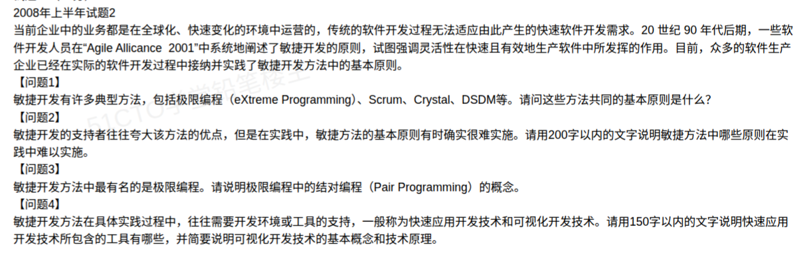

# 备考笔记：敏捷开发-基本原则与实践

## 一、题目

> **2008 年上半年试题 2**
>
> 当前企业中的业务都是在全球化、快速变化的环境中运营的，传统的软件开发过程无法适应由此产生的快速软件开发需求。20 世纪 90 年代后期，一些软件开发人员在"Agile Alliance 2001"中系统地阐述了敏捷开发的原则，试图强调灵活性在快速且有效地生产软件中所发挥的作用。目前，众多的软件生产企业已经在实际的软件开发过程中接纳并实践了敏捷开发方法中的基本原则。
>
> **【问题 1】** 敏捷开发有许多典型方法，包括极限编程（eXtreme Programming）、Scrum、Crystal、DSDM 等。请问这些方法共同的基本原则是什么？
>
> **【问题 2】** 敏捷开发的支持者往往夸大该方法的优点，但是在实践中，敏捷方法的基本原则有时确实很难实施。请用 200 字以内的文字说明敏捷方法中哪些原则在实践中难以实施。
>
> **【问题 3】** 敏捷开发方法中最有名的是极限编程。请说明极限编程中的结对编程（Pair Programming）的概念。
>
> **【问题 4】** 敏捷开发方法在具体实践过程中，往往需要开发环境或工具的支持，一般称为快速应用开发技术和可视化开发技术。请用 150 字以内的文字说明快速应用开发技术所包含的工具，并简要说明可视化开发技术的基本概念和技术原理。

**答案：问题 1——敏捷宣言的 4 条价值观与 12 条原则；问题 2——客户全程参与、面对面沟通、自组织团队、欢迎变更、持续交付、可持续节奏等原则在实践中最难落地；问题 3——结对编程 = 两人共用一台机器，一人"驾驶"、一人"领航"，角色定期互换；问题 4——快速应用开发工具含 CASE、4GL、代码生成器等，可视化开发以"所见即所得"的拖拽方式自动生成代码。**

## 二、知识点：敏捷开发

### 1. 核心原理

**敏捷开发** = 以**迭代、增量**方式，快速、灵活地交付**有价值的可工作软件**，并**响应变化**的一类开发方法的总称。代表方法有**极限编程（XP）、Scrum、Crystal、DSDM、FDD** 等。

**敏捷宣言**（2001 年，Agile Alliance）是各种敏捷方法**共同的基本原则**，含 **4 条价值观 + 12 条原则**。

**（1）敏捷宣言的 4 条价值观**

| 序号 | 价值观（左边高于右边，但并非否定右边） |
| --- | --- |
| 1 | **个体和互动** 高于 流程和工具 |
| 2 | **可工作的软件** 高于 详尽的文档 |
| 3 | **客户合作** 高于 合同谈判 |
| 4 | **响应变化** 高于 遵循计划 |

> 注意"**高于**"不等于"**否定**"——右边仍有价值，只是当二者冲突时**优先左边**。这是高频易错点。

**（2）敏捷宣言的 12 条原则**

1. 最优先的是**尽早、持续地交付有价值的软件**，使客户满意；
2. 即使在开发后期也**欢迎需求变更**，利用变更创造竞争优势；
3. **经常交付可工作的软件**，周期从几周到几个月，越短越好；
4. **业务人员和开发人员必须每天一起工作**；
5. 激发个体斗志，**以受信任的个体为核心**搭建项目，提供所需环境与支持；
6. 团队内**最有效的信息传递方式是面对面交谈**；
7. **可工作的软件是衡量进度的首要标准**；
8. 敏捷过程倡导**可持续开发**，保持稳定、不间断的节奏；
9. **持续关注技术卓越和良好设计**能增强敏捷能力；
10. **简单**（最大化未完成工作量的艺术）是根本；
11. 最好的架构、需求和设计出自**自组织团队**；
12. 团队**定期反思如何提高效率**，并据此调整行为。

### 2. 关键公式/规则

**（1）问题 2：实践中难以实施的原则（200 字内）**

> 一是"业务人员和开发人员每天一起工作"与"面对面交谈"，受客户可用时间、团队异地分布限制，难以长期保证。二是"欢迎需求变更""经常交付可工作软件"，需要持续集成、自动化测试等基础设施与稳定合同的支持，否则变更失控、交付成本高。三是"自组织团队"依赖高成熟度、高技能的成员和开放的管理文化，推行困难。四是"可持续的开发速度"在工期与成本压力下难以维持稳定节奏。

**（2）问题 3：结对编程的概念（Pair Programming）**

> 结对编程是极限编程（XP）的核心实践之一。**两名程序员共用一台计算机（同一键盘、显示器），并排协作完成同一段代码**：一人担任"**驾驶员（Driver）**"，负责实际敲入代码；另一人担任"**领航员（Navigator）**"，负责审视代码、思考方案、发现缺陷并提出改进建议。两人**角色可定期互换**。它既是一种编码方式，也是一种**实时的代码评审、知识共享与技能传递**方式，能减少缺陷、促进团队整体能力提升。

**（3）问题 4：快速应用开发工具与可视化开发技术（150 字内）**

> **快速应用开发（RAD）所包含的工具**：CASE 工具、第四代语言（4GL）、代码生成器、报表生成器、图形界面设计工具、原型构建工具等。
> **可视化开发技术的基本概念**：在图形化环境中，以"**所见即所得（WYSIWYG）**"的方式，通过拖拽、摆放控件来设计界面与构建应用，无需手工书写全部代码。
> **技术原理**：工具内置**可重用控件与代码模板**，用户拖放控件并设置属性，工具**自动生成**对应的源代码或配置，运行时以**事件驱动**机制响应操作。

### 3. 解题步骤

1. **问题 1（基本原则）**：直接答"敏捷宣言"的 **4 条价值观 + 12 条原则**。价值观要点出"**高于≠否定**"，原则要尽量写全（数量多者易得分）。
2. **问题 2（难实施的原则）**：从**客户参与、面对面沟通、欢迎变更、持续交付、自组织、可持续节奏**中挑 3~4 条，并说明"难"的原因（受合同、分布、基础设施、人员成熟度、工期约束）。**注意 200 字限制**。
3. **问题 3（结对编程）**：写清**"两人一机 + 两种角色 + 角色互换 + 价值（评审/共享）**"四个要点。
4. **问题 4（RAD 工具 + 可视化开发）**：先列**工具清单**（CASE、4GL、代码生成器等），再写**可视化开发的概念（WYSIWYG）与技术原理（控件+模板自动生成代码、事件驱动）**。**注意 150 字限制**。

## 三、易错点

1. **把"高于"理解成"否定"**：敏捷宣言说的是"**左边的项比右边的项更有价值**"，并不否认文档、流程、合同、计划的作用。答成"敏捷开发不需要文档"是典型错误。
2. **价值观与原则混淆**：**4 条是价值观**（个体互动、可工作软件、客户合作、响应变化），**12 条是原则**（具体到交付、沟通、团队、简单等）。题目问"基本原则"，**两层都要答**，只写 4 条价值观会漏掉大部分分值。
3. **漏答"共同方法"**：问题 1 问的是 XP、Scrum、Crystal、DSDM **共同**的原则，答案就是**敏捷宣言**，不要写成某一种方法（如只写 XP 的实践）的专属内容。
4. **问题 2 写成"敏捷的缺点"**：题目问的是"哪条**原则**难实施"，应落到**具体原则 + 难实施原因**，而不是泛泛批评敏捷"管理难、文档少"。
5. **结对编程写成"分工开发"**：结对编程是**两人协作同一段代码**（一人写、一人审），**不是两人各写一部分再合并**。必须点出**角色（驾驶员/领航员）**与**互换**。
6. **可视化开发原理写空**：不能只说"拖控件很方便"，要答出**"控件 + 代码模板自动生成源代码"**与**"事件驱动运行"**这一技术原理。
7. **超字数**：问题 2（200 字以内）、问题 4（150 字以内）有**字数限制**，写满或超限都可能扣分，务必精炼。

## 四、扩展延伸

- **敏捷方法家族对比**：**XP（极限编程）**实践最丰富（结对编程、测试驱动、持续集成、小版本发布、重构）；**Scrum**管理框架最典型（产品列表、冲刺、每日站会、冲刺评审与回顾、三种角色）；**Crystal**按项目规模选用不同"颜色"的方法；**DSDM**（动态系统开发方法）强调固定时间、可变范围。
- **Scrum 三种角色**：**产品负责人（Product Owner）**负责需求优先级；**Scrum Master** 负责扫除障碍、保障流程；**开发团队**自组织完成冲刺目标。
- **XP 的核心实践**：结对编程、测试驱动开发（TDD）、持续集成、重构、小版本发布、现场客户、编码规范、简单设计——详见 [90-软件开发模型-论文写作要点.md](90-软件开发模型-论文写作要点.md) 中"敏捷开发"条目。
- **敏捷 vs 传统（瀑布）**：瀑布强调**文档、计划、阶段**，敏捷强调**快速反馈、可工作软件、响应变化**；两者并非绝对对立，实践中常"**主模型 + 敏捷实践**"混用。
- **快速应用开发（RAD）的地位**：RAD 是**以原型迭代、快速交付**为核心的开发方法族，与敏捷理念相近但更早出现；它**依赖可视化开发工具和 CASE 工具支撑**，这正是问题 4 的落点。
- **现实类比**：**敏捷宣言**＝"**菜要现做现吃**（可工作软件），边做边听食客意见（客户合作），不照菜单死磕（响应变化）"；**结对编程**＝"**一人开车、一人看导航**，轮流换手"；**可视化开发**＝"**搭积木**"——拖拽现成控件，工具自动帮你生成代码。

## 五、错题归档

| 题号 | 题型 | 考点 | 难度 | 掌握度 |
| --- | --- | --- | --- | --- |
| 2008 上-敏捷开发 | 案例分析（问题 1） | 敏捷方法**共同的基本原则**：敏捷宣言 **4 价值观 + 12 原则** | 中 | 薄弱 |
| 2008 上-敏捷开发 | 案例分析（问题 2） | 实践中**难以实施的原则**及原因（200 字内） | 中 | 薄弱 |
| 2008 上-敏捷开发 | 案例分析（问题 3） | **结对编程**的概念（驾驶员/领航员、角色互换） | 易 | 待复习 |
| 2008 上-敏捷开发 | 案例分析（问题 4） | **快速应用开发工具**与**可视化开发技术**的概念与原理（150 字内） | 中 | 待复习 |

## 六、相关图片

原题截图：`../images/93-敏捷开发-基本原则与实践.png`（由用户上传的原题图复制改名而来）

