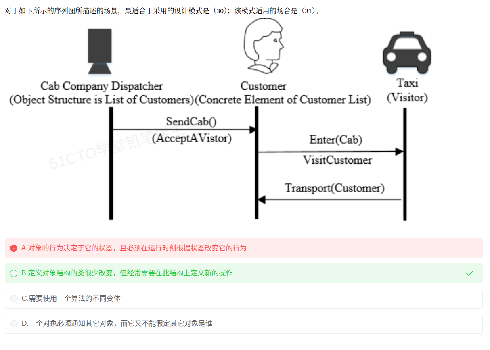

# 备考笔记：设计模式-访问者模式场景识别

## 一、题目
> 对于如下所示的序列图所描述的场景，最适合于采用的设计模式是（30）；该模式适用的场合是（31）。
>
> （序列图：Cab Company Dispatcher [Object Structure is List of Customers] 向 Customer [Concrete Element of Customer List] 发送 SendCab()（AcceptAVisitor）；Customer 调用 Taxi [Visitor] 的 Enter(Cab) 与 VisitCustomer；Taxi 回调 Customer 的 Transport(Customer)。）
>
> A. 对象的行为决定于它的状态，且必须在运行时刻根据状态改变它的行为
> B. 定义对象结构的类很少改变，但经常需要在此结构上定义新的操作
> C. 需要使用一个算法的不同变体
> D. 一个对象必须通知其它对象，而它又不能假定其它对象是谁

**答案：30. 访问者模式（Visitor）；31. B**

## 二、知识点：设计模式-访问者模式场景识别

### 1. 核心原理
访问者模式（Visitor）把**作用于某对象结构中各元素的操作**分离出来，封装成独立的**访问者对象**，从而在不改变各元素类的前提下定义作用于这些元素的新操作。

- **ObjectStructure（对象结构）**：如题中的"Cab Company Dispatcher"，它持有元素列表 `List of Customers`，并提供遍历入口。
- **Element（元素）**：如"Customer"，提供 `AcceptAVisitor()` 接受访问者。
- **Visitor（访问者）**：如"Taxi"，提供针对每个元素类型的访问方法 `VisitCustomer()`。
- **双重分派（double dispatch）**：`AcceptAVisitor` 决定"谁来访问"，`Visit` 决定"访问谁"，二者组合才确定最终执行的操作——这是访问者模式最本质的特征。

题中 `Customer.AcceptAVisitor → Taxi.VisitCustomer → Customer.Transport(Customer)` 正是"元素接受访问者 → 访问者回调元素"的典型双向交互。

### 2. 关键公式/规则
| 名称 | 表达式/判据 |
| --- | --- |
| 模式分类 | 行为型模式（对象行为型） |
| 模式意图 | 在不改变元素类的前提下，为对象结构中的元素定义新操作 |
| 识别关键词 | 对象结构稳定 + 操作频繁新增 + 双重分派（Accept / Visit） |
| 适用场合 | **对象结构的类很少改变，但经常需要在此结构上定义新的操作**（即本题 31 题 B 项） |
| 典型代价 | 增加新的元素类困难（需改动所有访问者） |

### 3. 解题步骤
1. **看序列图角色**：找"对象结构 + 元素 + 外部访问者"三件套。题中 Dispatcher 是对象结构、Customer 是元素、Taxi 是访问者。
2. **看交互是否为双重分派**：`AcceptAVisitor()` 后由访问者 `VisitXXX()` 回调元素——命中即为访问者模式。
3. **匹配适用场合**：题目问"适用场合"时，直接选描述"结构稳定、操作易变"的选项，即 B。
4. **排除干扰项**：
   - A → 状态模式（行为随状态改变）
   - C → 策略模式（算法可替换的多变体）
   - D → 观察者模式（一对多通知、不假定通知对象）

## 三、易错点
1. **别被"序列图"误导**：序列图既可描述交互也可描述设计模式，关键看角色与分派方式，不能因"交互图"就选观察者/中介者。
2. **双重分派是关键指纹**：只出现 `Accept` 无 `Visit` 回调，不足以判定为访问者模式。
3. **适用场合的表述**：常考"结构稳定、操作多变"，与"结构多变、操作稳定"相反的是组合/装饰类场景。
4. **A/C/D 的对应模式要背熟**：状态、策略、观察者三者是访问者题最常见的干扰项。
5. **访问者属于行为型（对象行为型）**，不要误判为结构型或类行为型。

## 四、扩展延伸
- **开闭原则的取舍**：访问者对"新增操作"开放（加一个访问者即可），但对"新增元素"封闭——新增元素要改所有 Visitor 接口。
- **现实类比**：医院里医生（Visitor）依次巡诊各科室病人（Element），病人只负责"接受问诊"，具体诊疗手段由不同医生决定；病人种类稳定，而诊疗项目经常增加。
- **与组合模式配合**：访问者常作用于组合模式构建的树形对象结构上，遍历树枝/树叶并施加操作。
- **考点串联**：23 种模式三分类（创建型 5 / 结构型 7 / 行为型 11），访问者属行为型，常与策略、状态、观察者、命令同题混考。

## 五、错题归档
| 题号 | 题型 | 考点 | 难度 | 掌握度 |
| --- | --- | --- | --- | --- |

（重做本题时在表尾追加 `重做 N` 行，见「步骤 2.5 重做留痕」）

## 六、相关图片
原题截图：`../images/96-设计模式-访问者模式场景识别.png`（由用户上传的原题图复制改名而来）

