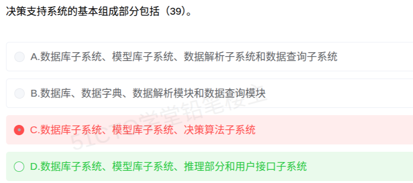

# 备考笔记：决策支持系统DSS-基本组成部分与推理部分归属

## 一、题目

> 决策支持系统的基本组成部分包括（39）。
>
> A. 数据库子系统、模型库子系统、数据解析子系统和数据查询子系统
>
> B. 数据库、数据字典、数据解析模块和数据查询模块
>
> C. 数据库子系统、模型库子系统、决策算法子系统
>
> D. 数据库子系统、模型库子系统、推理部分和用户接口子系统

**答案：D. 数据库子系统、模型库子系统、推理部分和用户接口子系统**

解析：软考教材把 DSS 的基本结构划分为**四部分**——**数据部分、模型部分、推理部分、人机交互部分**。四部分与选项 D 一一对应：数据部分就是**数据库子系统**，模型部分就是**模型库子系统**，推理部分由**知识库 + 知识库管理系统 + 推理机**组成，人机交互部分就是**用户接口（对话）子系统**，故选 D。A 项的"数据解析子系统、数据查询子系统"、B 项的"数据解析模块、数据查询模块"、C 项的"决策算法子系统"都是杜撰名词；B 项还漏掉了必需的模型库，C 项也与四部分结构不符。

## 二、知识点：决策支持系统DSS-基本组成部分与推理部分归属

### 1. 核心原理

**DSS（决策支持系统）是辅助决策者以人机交互方式处理半结构化/非结构化决策的计算机应用系统**，教材给出的**基本结构由四部分组成**：

| 部分 | 对应子系统 | 作用 |
| --- | --- | --- |
| 数据部分 | 数据库子系统 | 存放决策所需的内外部数据，提供数据能力 |
| 模型部分 | 模型库子系统 | 存放预测、优化、评价等决策模型，提供分析能力 |
| 推理部分 | 知识库 + 知识库管理系统 + 推理机 | 提供知识推理，支撑定性判断 |
| 人机交互部分 | 用户接口（对话）子系统 | 接收并校验用户请求，调用内部功能、呈现结果 |

**要点**：

- 题干问的是"**基本组成部分**"（范围 = 四部分），不是"**两库**"（范围 = 数据库 + 模型库）。
- 四部分缺一不可：**少了人机交互（用户接口）就不成立**，这正是 A、B 两项的硬伤。
- **推理部分**是本题的关键：教材四部分结构把"知识库 + 推理机"的推理能力列入 DSS 基本组成。
- 与**两库结构**口径区分：两库结构只谈"数据库子系统 + 模型库子系统"两个**库**，不涉及推理部分与用户接口（详见 47 号笔记）。

### 2. 关键公式/规则

| 结构提法 | 组成 |
| --- | --- |
| 两库结构 | 数据库子系统 + 模型库子系统 |
| Sprague 三部件结构（1980） | 数据部件 + 模型部件 + 对话部件（即"两库三部件"） |
| **四部分结构（本题口径）** | **数据部分（数据库子系统）+ 模型部分（模型库子系统）+ 推理部分 + 人机交互部分（用户接口子系统）** |
| 三库结构 | 数据库 + 模型库 + 方法库（+ 对话） |
| IDSS（智能 DSS） | DSS + 专家系统（**知识库 + 推理机**），定性推理与定量计算结合 |
| 新 DSS | 数据仓库 DW + 联机分析处理 OLAP + 数据挖掘 DM |

记忆口诀：**"数据打底、模型分析、推理判断、接口交互——四部分缺一不可。"**

### 3. 解题步骤

1. **抓题干关键词**：DSS、"基本组成部分"、"包括"。
2. **回忆四部分结构**：数据部分、模型部分、推理部分、人机交互部分。
3. **逐项对照**：D 的四项与四部分一一对应 → 数据（数据库子系统）、模型（模型库子系统）、推理部分、用户接口子系统。
4. **排除杜撰项**：A 的"数据解析子系统/数据查询子系统"、B 的"数据字典/数据解析模块/数据查询模块"、C 的"决策算法子系统"均非 DSS 部件名；B 还缺模型库，A 缺用户接口。
5. **定答案**：选 **D**。

## 三、易错点

1. **误以为"推理部分"只属 IDSS**：本题按教材"四部分结构"口径，推理部分属 DSS 基本组成。注意区分口径——考"两库结构"时知识/推理不在其内（见 47 号笔记），考"基本组成部分"时推理部分在内。
2. **把"两库"当成"全部组成"**：两库特指数据库 + 模型库；本题问的范围更大（四部分），只答两库会漏掉推理部分与用户接口。
3. **漏看"用户接口/对话"是必需件**：人机交互部件是四部分之一，A、B 都因缺它（或缺模型库）而错。
4. **被"数据解析子系统、数据查询子系统"迷惑**：这两个名词是杜撰的，数据存取与查询本就是数据库子系统的职责，不另设子系统。
5. **误选"决策算法子系统"（本次错选 C）**：不存在该子系统；决策算法/方法属**模型库**的内容，或属方法库（方法库是"三库/四库结构"的扩展件），不单列成子系统。
6. **把数据字典当成并列子系统**：数据字典是数据库管理与数据字典管理的内部构件，不能与数据库子系统、模型库子系统并列。
7. **混淆 DSS 与 MIS**：MIS 侧重结构化信息处理与例行报表，DSS 侧重半/非结构化决策，模型库是 DSS 区别于 MIS 的关键。

## 四、扩展延伸

- **信息系统家族辨析**：

| 系统 | 处理问题的结构化程度 | 核心部件特征 |
| --- | --- | --- |
| MIS（管理信息系统） | 结构化 | 数据库为主，例行报表 |
| **DSS（决策支持系统）** | **半结构化** | **数据 + 模型 + 推理 + 人机交互（四部分）** |
| IDSS（智能 DSS） | 半/非结构化 | DSS + **专家系统（知识库 + 推理机）** |
| GDSS（群体 DSS） | 半/非结构化 | DSS + **通信与协调机制**，支持群体协同决策 |
| 新 DSS | 半/非结构化 | **数据仓库 DW + OLAP + 数据挖掘 DM**，从数据中获取决策信息 |

- **两种口径对照（本笔记与 47 号笔记的关系）**：
  - **两库结构**（47 号题）：只论"库"，= 数据库子系统 + 模型库子系统，知识子系统不在其内。
  - **四部分结构**（本题）：论"基本组成"，= 数据 + 模型 + 推理 + 人机交互，推理部分在内。
  - 记忆抓手：**问"两库"只答两个库；问"基本组成部分"要数齐四部分。**
- **推理部分的构成**：知识库（KB）+ 知识库管理系统（KBMS）+ 推理机。当 DSS 与专家系统（ES）结合、把"知识推理"作为核心能力时，即升级为 **IDSS**。
- **现实类比**：把 DSS 想象成一位"决策参谋"——数据库是他的资料柜，模型库是他掌握的各种分析方法，推理部分是他的判断与经验，用户接口是他跟你沟通汇报的渠道。四样齐了才能出谋划策。
- **相关笔记**：47-决策支持系统DSS-两库结构与知识子系统归属。

## 五、错题归档

| 题号 | 题型 | 考点 | 难度 | 掌握度 |
| --- | --- | --- | --- | --- |
| 软考-系统工程与信息技术基础（39） | 单选 | 决策支持系统 DSS 基本组成四部分（数据/模型/推理/用户接口）与推理部分归属 | 易 | 待复习 |

## 六、相关图片

原题截图：`../images/97-决策支持系统DSS-基本组成部分与推理部分归属.png`（由用户上传的原题图复制改名而来）

