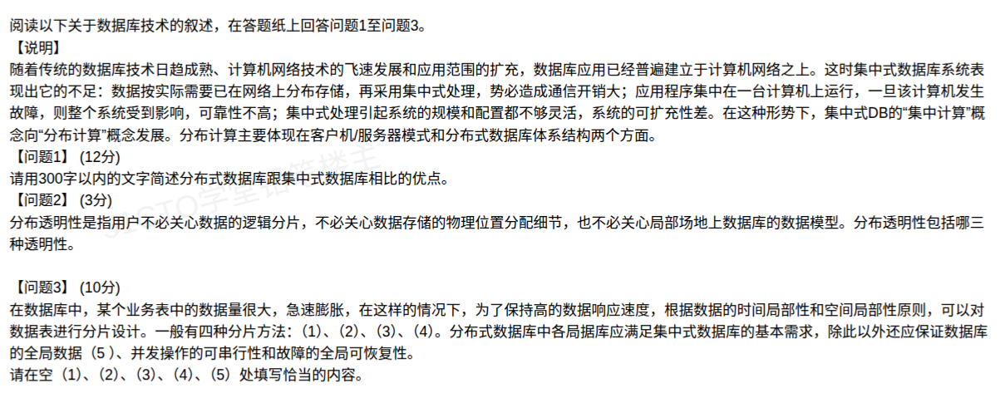

## 分布式数据库案例分析题（解答）

本题围绕分布式数据库相对集中式数据库的优势、分布透明性、数据分片设计三个考点展开。

### 问题1：分布式数据库相比集中式数据库的优点

**答题要点（作答控制在 300 字以内）：**

分布式数据库具有以下优点：

1. **数据分布合理，适应分布式应用**。数据物理上分散存储在多个结点，逻辑上集中统一管理，契合地理上分散的组织结构，避免数据长途传输。
2. **局部自治，响应快、通信开销小**。各结点可独立处理本地数据，多数操作就地完成，减少网络传输量。
3. **可靠性高、可用性好**。数据可冗余存放多份副本，单个结点或链路故障时，系统仍可依靠其他副本继续工作，不致使全局瘫痪。
4. **可扩充性、灵活性好**。系统规模可按需逐步扩展，增删结点方便，配置灵活，不像集中式那样受单机容量限制。
5. **数据共享性好，负载分散**。便于跨地域、跨部门整合共享数据，且处理负载由多结点分担，整体处理能力强。

> 记忆主线：**数据分布（适应组织）+ 局部自治（省通信）+ 冗余可靠（抗故障）+ 易扩充（好扩展）+ 好共享（可分担）**。

### 问题2：分布透明性的三种类型

分布式数据库的**分布透明性**包括三种，层次由高到低：

| 透明性 | 含义 | 对应题干描述 |
| --- | --- | --- |
| **分片透明性** | 用户只对**全局关系**操作，不必关心数据是如何逻辑分片的（分片对用户不可见） | "不必关心数据的逻辑分片" |
| **位置透明性** | 用户不必关心数据分片存储在哪个物理场地上 | "不必关心数据存储的物理位置分配细节" |
| **局部数据模型透明性** | 用户不必关心各局部场地采用何种数据模型（如关系、网状），也不关心局部的概念/物理模式 | "也不必关心局部场地上数据库的数据模型" |

三者关系：分片透明性最高（用户只见全局关系）→ 位置透明性次之 → 局部数据模型透明性最低。**透明层次越高，用户使用越简单，但系统实现越复杂、开销越大。**

### 问题3：数据分片设计填空

**（1）水平分片**　**（2）垂直分片**　**（3）混合分片**　**（4）导出分片**　**（5）一致性**

**四种分片方法：**

1. **水平分片**：按**行**划分，把关系按元组（记录）分组，每组构成一个分片。如按地区把订单表拆成华东、华北子表。
2. **垂直分片**：按**列**划分，把关系的属性（字段）分组，每组构成一个分片，通常需保留主键以便重构。如把用户表拆成基本信息表与财务信息表。
3. **混合分片**：水平分片与垂直分片**结合**使用，先水平再垂直（或反之）。
4. **导出分片**：其分片条件**由另一个关系的属性值决定**，即依据其他关系的取值来定义本关系的分片（如按部门表推导员工表的分片）。

**（5）一致性**

分布式数据库**全局数据应满足的三个一致性要求（ADDS 中的全局约束）**：
- 全局数据的**一致性**
- 并发操作的**可串行性**
- 故障的**全局可恢复性**

> 分片正确性还需满足三条准则：**完备性**（全局关系的数据都能被分片覆盖）、**可重构性**（可由分片重构出全局关系）、**不相交性**（任一元组不重复出现在多个分片中，除主键副本外）。

### 考点小结

- 本题三段分别对应**分布式的价值（优点）**、**分布透明性的层次（三种）**、**分片设计（四种方法 + 全局一致性）**。
- 高频易错点：分片四种方法中，**导出分片**最易被忽略（前三种按数据自身行列划分，导出分片依赖其他关系）；透明性顺序不能颠倒（分片 > 位置 > 局部数据模型）。
- 与 CAP 理论衔接：分布式数据库的高可靠性、可扩充性正是靠**数据冗余与分布**换来，而冗余又引出**一致性**代价，是同一问题的两面。
