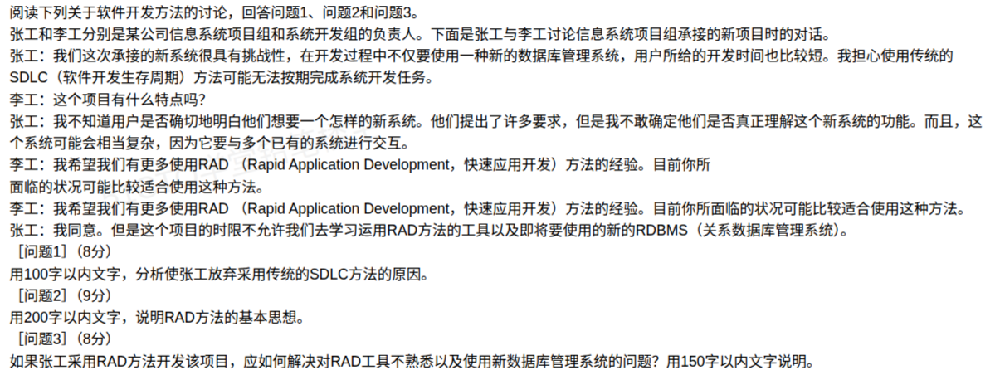

## RAD 快速应用开发与 SDLC 案例分析题（解答）

本题围绕传统 SDLC 方法的局限、RAD 方法的基本思想、以及 RAD 落地时的技术与人员风险三个考点展开。背景是张工面临"需求不明确、系统复杂、工期短、且要引入新技术"的新项目，需要判断是否放弃 SDLC、改用 RAD。

### 问题1：放弃传统 SDLC 方法的原因

**答题要点（作答控制在 100 字以内）：**

本项目用户需求不明确，系统复杂且需与多个已有系统交互，开发时间又短。传统 SDLC 要求前期完整确定需求、按阶段串行推进、周期长、文档重，无法适应需求模糊与快速交付的要求，故须放弃。

**展开分析：**

| 项目特征 | SDLC 的先天不适 |
| --- | --- |
| 用户需求不明确，说不清想要什么系统 | SDLC 要求需求分析阶段就冻结需求，需求变更加工代价大 |
| 系统复杂，需与多个已有系统交互 | SDLC 前期需完整设计，设计与集成难度大、周期被拉长 |
| 开发时间短（工期紧） | SDLC 阶段串行、周期长、文档繁多，难以按期交付 |
| 引入新技术（新 DBMS） | SDLC 难以快速验证技术可行性与方案调整 |

> 一句话记忆：**需求不清 + 系统复杂 + 工期紧**，正是瀑布式 SDLC 的三个"死穴"。

### 问题2：RAD 方法的基本思想

**答题要点（作答控制在 200 字以内）：**

RAD 是一种以用户为中心、快速迭代的增量开发方法。它强调用户全程参与，通过快速构建可视化原型，让用户尽早看到可运行的系统并及时反馈，从而逐步明确并修正需求；借助可视化建模工具、构件复用与代码自动生成提高开发效率；采用小团队、专人负责的组织方式缩短沟通与决策路径。其核心是"快"：快速原型、快速反馈、快速交付，以适应用户需求不明确、工期紧张的场景。

**展开要点：**

1. **以用户为中心**：用户（或用户代表）全程深度参与，需求在协作中逐步清晰。
2. **原型驱动 + 迭代增量**：先快速做出可运行原型，让用户"看得见、摸得着"，边用边改。
3. **工具与构件支撑**：可视化建模工具、可重用构件库、代码生成器，是"快速"的物质基础。
4. **小团队、强沟通**：精简组织、责任到人，缩短反馈回路，快速决策。
5. **目标是快速交付**：用短周期换敏捷，优先可用，允许后续迭代完善。

### 问题3：如何解决工具不熟与新 DBMS 的问题

**答题要点（作答控制在 150 字以内）：**

①引进或聘请熟悉 RAD 工具和该 DBMS 的技术专家充实项目组；②对现有人员开展针对性培训，并争取工具与数据库厂商的技术支持；③选用成熟、文档齐全、与该 DBMS 兼容性好的 RAD 工具和构件库，尽量复用已有构件；④先做一小型原型试点，边学边用，积累经验后再全面展开，降低风险。

**展开对策：**

- **人员**：外聘专家 / 引入有经验的技术骨干；对团队成员进行专项培训。
- **工具与产品**：优先选成熟、文档完善、与该 DBMS 集成良好的 RAD 工具；必要时更换为团队更易上手的 DBMS。
- **复用**：充分利用已有的、熟悉的技术与构件，减少新学成本。
- **外部支持**：借助工具厂商、数据库厂商的技术支持与培训服务。
- **试点**：先小范围做原型，验证技术路线、积累经验，再推广。

### 考点小结

**SDLC 与 RAD 对比：**

| 维度 | SDLC（瀑布） | RAD（快速应用开发） |
| --- | --- | --- |
| 需求前提 | 前期须明确并冻结 | 需求可不明确，边做边明确 |
| 开发方式 | 阶段串行、线性推进 | 原型迭代、增量交付 |
| 用户参与 | 主要在需求阶段 | 全程深度参与 |
| 周期 | 长 | 短 |
| 文档 | 重（完整规范） | 相对轻 |
| 适用场景 | 需求明确、稳定的项目 | 需求模糊、工期紧、中小规模、用户可深度参与的项目 |

**易错点：**
- RAD 不是"不要文档、不要设计"，而是把设计与文档**做轻、做快**，用原型替代部分说明书，通过迭代逐步明确需求。
- RAD 要求**用户能深度参与**；若用户无法投入，RAD 效果会大打折扣，这是其适用前提。
- 与易错题本「116-RAD 快速应用开发与 SDLC 方法选型」相互印证：**选开发模型的依据是项目特征（需求明确度、规模、工期、用户参与度），而非模型本身优劣。**
