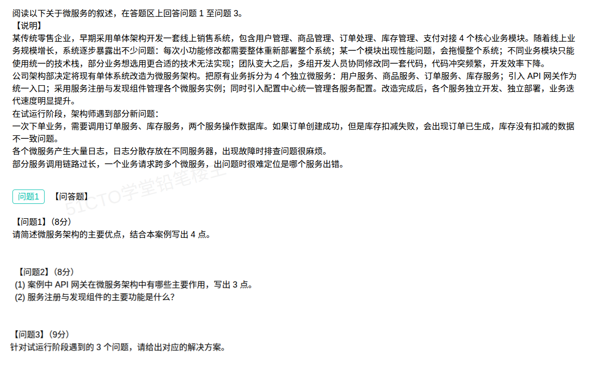

## 微服务架构案例分析题（解答）

本题围绕传统企业由单体架构改造为微服务架构后的价值、微服务核心组件（API 网关、服务注册与发现）、以及试运行阶段的分布式治理问题三个考点展开。背景是某零售企业原单体销售系统命中四个"单体病"——改一处要整体重部署、单模块拖垮全局、多团队改同一套代码冲突频发、技术栈被绑死，于是拆成用户 / 商品 / 订单 / 库存 4 个微服务。

### 问题1：微服务架构的主要优点（结合案例，写 4 点）

**答题要点：**

1. **独立部署、独立上线**：每个服务可单独开发、构建、部署、升级，改一个小功能只重部署该服务，不必整体重新部署，交付更快。
2. **故障隔离、可用性高**：单个服务出现性能问题或宕机，只影响自身，不会拖垮整个系统，其余服务照常运行。
3. **团队自治、并行开发**：按业务边界拆分服务、小团队独立负责，多组人员并行开发，不再共用同一套代码，代码冲突少、协作效率高。
4. **技术异构、选型灵活**：各服务可采用最适合自身业务的技术栈（语言、框架、数据库），不必被统一技术栈绑死。

（可补充的加分点：**按需独立扩展 / 弹性伸缩**——只对高负载服务扩容；**高内聚低耦合、边界清晰**，便于维护、复用与演进。）

> 记忆主线：**独立部署 + 故障隔离 + 团队自治 + 技术异构**，正是案例中四个痛点的"对症之药"，一病一药。

### 问题2：API 网关与服务注册发现

**（1）API 网关在微服务架构中的主要作用（写 3 点，任答满 3 点）：**

1. **统一入口与路由转发**：所有客户端请求统一经网关进入，按路径 / Header 等匹配，转发到对应的后端微服务，客户端无需感知各服务地址。
2. **统一鉴权与安全管控**：在网关集中做身份认证、令牌校验、权限控制、防爬防刷，避免每个服务各写一遍安全逻辑。
3. **流量治理（限流 / 熔断 / 降级）与负载均衡**：按 IP / 用户 / 接口限流，熔断异常服务、降级兜底，并把请求分发到多实例。

（可补充：**协议转换 / 请求聚合**、**统一日志与链路追踪入口**、**灰度 / 蓝绿发布**、**缓存加速**。）

**（2）服务注册与发现组件的主要功能：**

1. **服务注册**：服务实例启动时，把自身网络信息（IP、端口、服务名、版本、元数据）登记到注册中心。
2. **服务发现**：服务消费者从注册中心查询可用实例列表，并订阅 / 缓存到本地，实现"实例位置透明"的动态寻址。
3. **健康检查与上下线通知**：注册中心定期探测实例健康状态，自动剔除故障实例，并在实例上下线时通知订阅方更新本地缓存。

> 答题口诀：API 网关记"**入口 + 鉴权 + 限流**"三件套；服务注册发现记"**注册 + 发现 + 健康检查**"三件套。
> 详见易错题本 [115-微服务架构组件-API网关与服务注册发现.md](../易错题本/115-微服务架构组件-API网关与服务注册发现.md)。

### 问题3：试运行阶段 3 个问题的解决方案

| 试运行遇到的问题 | 对应解决方案 |
| --- | --- |
| ① 跨服务事务不一致（订单创建成功但库存扣减失败，产生"订单已生成、库存未扣减"的脏数据） | 引入**分布式事务 / 最终一致性**方案：**Saga（补偿事务）**、**TCC（Try-Confirm-Cancel）**、**可靠消息最终一致性**（本地消息表 / 事务消息）、或 **Seata** 类框架；对失败分支做**补偿回滚**（如取消订单 / 恢复库存） |
| ② 各服务日志量大会散落在不同服务器，故障排查麻烦 | 搭建**集中式日志管理系统**（ELK / EFK、Loki + Grafana）：统一采集各服务日志、集中存储、统一检索与可视化；并在日志中带上全局 `traceId`，便于按请求串联排查 |
| ③ 调用链路过长、一个请求跨多个微服务，难定位哪个服务出错 | 引入**分布式链路追踪**（Sleuth + Zipkin、SkyWalking、Jaeger）：为每个请求生成全局唯一的 `traceId` 并贯穿各微服务，记录每个 `span` 的调用关系与耗时，可视化定位最慢 / 出错的服务；配合 APM 监控告警 |

**展开说明：**

- **问题① 数据一致性**：单体时代一个本地事务能保证的原子性，拆成微服务后变成跨库、跨服务操作，必须靠**分布式事务**或**最终一致性**来保证；对下单这类业务，常用"**先扣库存再加订单（或可靠消息 + 补偿）**"的思路，并做好幂等与失败补偿。
- **问题② 日志分散**：核心是"**采集—传输—集中存储—统一检索**"四步，把散落多机的日志汇到一处；同时统一日志格式与 `traceId`，让"按一次请求查全链路日志"成为可能。
- **问题③ 链路难定位**：核心是"**给每个请求一个全局身份（traceId）+ 记录调用链各节点的父子关系与耗时**"，从而一眼看出是哪个服务、哪一段调用拖慢或报错。

### 考点小结

**单体架构 vs 微服务架构：**

| 维度 | 单体架构 | 微服务架构 |
| --- | --- | --- |
| 部署 | 整体部署，改一处动全身 | 服务独立部署、独立上线 |
| 故障影响 | 单模块故障拖垮全局 | 故障隔离，单服务故障不影响全局 |
| 团队协作 | 多团队共用一套代码，冲突多 | 按业务拆分，小团队自治、并行开发 |
| 技术栈 | 统一绑定，选型受限 | 技术异构，按服务自由选型 |
| 扩展 | 整体扩容，成本高 | 按需对单服务弹性伸缩 |
| 代价 | 简单、运维轻 | 分布式复杂度高：事务一致、日志、链路、治理等 |

**试运行三问题 → 三类分布式治理组件（配套记忆）：**

| 问题 | 治理手段 | 常用组件 |
| --- | --- | --- |
| 跨服务数据不一致 | 分布式事务 / 最终一致性 | Seata、可靠消息、Saga / TCC |
| 日志分散难排查 | 集中式日志 | ELK / EFK、Loki |
| 调用链长难定位 | 分布式链路追踪 | SkyWalking、Zipkin、Jaeger |

**易错点：**
- 答微服务"优点"时要**结合案例逐条对应**（独立部署 ↔ 整体重部署、故障隔离 ↔ 单模块拖垮全局、团队自治 ↔ 代码冲突、技术异构 ↔ 技术栈绑死），不要只背通用概念。
- **服务注册与发现 ≠ 配置中心**：注册中心管"实例地址 + 健康状态"，配置中心管"配置参数"，案例中二者是并列组件，不能混答。
- **API 网关 ≠ 路由器 / 防火墙**：网关是业务级统一接入层，除路由外还要答出**鉴权、限流熔断**等治理能力。
- 答问题3 要"**一问题一方案、方案对得上痛点**"，并点出具体组件名（如 SkyWalking、ELK、Seata），比只写"用分布式事务解决"更得分。
- 与易错题本 [32-微服务系统特征.md](../易错题本/32-微服务系统特征.md)（微服务特征）、[115-微服务架构组件-API网关与服务注册发现.md](../易错题本/115-微服务架构组件-API网关与服务注册发现.md)（组件细节）相互印证。
