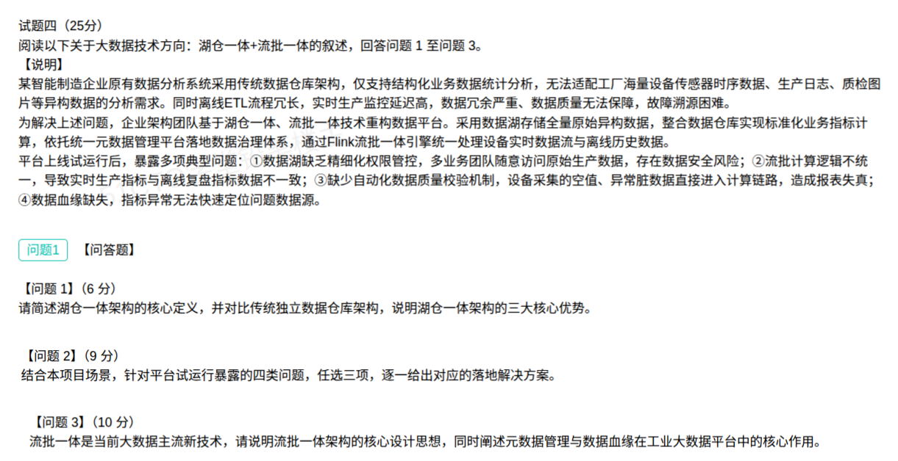

## 湖仓一体与流批一体案例分析题（解答）

本题以某智能制造企业重构大数据平台为背景，围绕**湖仓一体**（定义与优势）、**平台落地治理**（权限、口径、质量、血缘）与**流批一体 + 元数据 / 数据血缘**三个考点展开。

原系统问题是：传统数仓只支持结构化统计分析，无法适配设备时序、生产日志、质检图片等**异构数据**，且离线 ETL 冗长、实时监控延迟高、数据冗余、质量无保障、故障难溯源。

改造思路是**数据湖存全量原始异构数据 + 数据仓库做标准化指标 + 统一元数据管理做治理 + Flink 流批一体统一处理**。

### 问题1（6分）：湖仓一体架构的核心定义与三大核心优势

**核心定义：**

> **湖仓一体（Data Lakehouse）** 是一种将**数据湖**与**数据仓库**能力融合到同一套架构上的新型开放式数据架构：底层用数据湖的**低成本、多格式、存算分离**存储能力承接结构化 / 半结构化 / 非结构化**全量原始数据**；在其上通过**开放表格式**（Iceberg / Hudi / Delta Lake）叠加数据仓库的**事务（ACID）、Schema 管理、高性能查询、数据治理**能力。实现"**一份数据存储、多种引擎按需分析**"，湖与仓之间**无需反复搬运数据**。

**对比传统独立数据仓库架构的三大核心优势（写 3 点）：**

1. **支持异构数据的统一存储与分析**：湖仓一体可直接存储并分析设备时序、生产日志、质检图片等结构化 / 半结构化 / 非结构化数据；传统数仓只支持结构化数据，异构数据须先经 ETL 转换模型后才能入库，适配性差。
2. **存算分离、弹性扩展、成本更低**：基于廉价对象存储保存全量原始数据，计算资源按需弹性伸缩；传统数仓存算耦合、扩容需整体升级，成本高、周期长。
3. **一份数据免搬运、链路更短、时效更高**：原始明细与标准化指标在同一份数据上完成，避免了传统"数据湖 → 数据仓库"的搬迁与多份冗余，减少 ETL 环节、缩短链路、降低实时监控延迟；同时兼具数仓的事务可靠性与数据湖的开放性。

（可补充的加分点：**ACID 事务 + Schema 演进 + 时间旅行**保证数据可靠可追溯；**开放格式避免厂商锁定**；**流批统一读写**支撑实时与离线一体化。）

> 一句话记忆：**湖的灵活 + 仓的能力，一体存储、一体管理、免搬运**。

### 问题2（9分）：四类问题，任选三项给落地方案

| 试运行暴露的问题                                | 落地方案                                                                                                                                                          |
| --------------------------------------- | ------------------------------------------------------------------------------------------------------------------------------------------------------------- |
| ① 数据湖缺乏精细化权限管控，多业务团队随意访问原始生产数据，存在安全风险   | 建设**统一数据安全与权限治理**：对数据湖分层分域（原始区 / 明细区 / 汇总区），基于统一元数据实现**库 / 表 / 行 / 列级细粒度授权**，落地 **RBAC + ABAC** 模型与**最小权限**原则；统一身份认证（SSO / LDAP），对敏感字段做**脱敏 / 加密**，全程**审计留痕** |
| ② 流批计算逻辑不统一，导致实时生产指标与离线复盘指标不一致          | 用 **Flink 流批一体 + 统一 SQL / 统一代码**，让"实时"与"离线"跑**同一份计算逻辑、读同一份数据湖表**；统一**指标口径与元数据定义**、统一时间语义与水位线，从源头消除两套链路的口径分歧（详见问题3）                                            |
| ③ 缺少自动化数据质量校验机制，空值、异常脏数据直接进入计算链路，造成报表失真 | 建立**自动化数据质量平台（DQC）**：在采集 / 入湖 / 计算各环节配置质量规则（**空值率、唯一性、值域范围、一致性、及时性**），实时（Flink）+ 离线（T+1）双校验；脏数据**拦截并隔离**到异常区 / 死信队列，触发**告警与修复**，质量结果回写元数据，形成质量闭环              |
| ④ 数据血缘缺失，指标异常无法快速定位问题数据源                | 在统一元数据平台上建设**数据血缘（Data Lineage）**：自动解析任务 / SQL 依赖，采集**表级 + 字段级血缘**形成数据地图；指标异常时可**顺链路正查 / 反查**，快速定位问题数据源及受影响的下游，支撑**故障溯源与影响分析**                                |

**展开说明（任选三项即可，以下为更细的落地动作）：**

- **① 权限管控**：不能只答"加权限"，要点出**分层分域 + 细粒度（行 / 列级）+ RBAC/ABAC + 脱敏加密 + 审计**四件套，体现"数据湖也要有数仓级治理"。
- **② 口径统一**：核心是"**一份逻辑、一份数据、一份口径**"——Flink 统一 SQL / Table API，实时与离线共用同一业务逻辑；配合统一指标平台，避免"两套代码各算一遍"。
- **③ 数据质量**：核心是"**规则化 + 自动化 + 闭环**"——规则可配置、校验自动跑、脏数据能拦能隔离、异常有告警、责任能追踪。
- **④ 数据血缘**：核心是"**关系可视化 + 双向可追**"——上游改动能评估影响面（影响分析），下游异常能快速回溯源头（根因定位）。

### 问题3（10分）：流批一体核心设计思想 + 元数据管理与数据血缘的作用

**（1）流批一体架构的核心设计思想：**

1. **流与批本质统一**：批是有界的流、流是无界的批，二者本质都是"数据流"，用**同一套引擎、同一套 API / SQL**（如 Flink DataStream / Table API / SQL）处理，不再维护两套代码。
2. **统一存储与统一数据源**：实时流与离线批读**同一份数据湖存储**，避免 Lambda 架构"流批两条链路、两份数据"的冗余与不一致。
3. **统一计算逻辑与口径**：同一业务逻辑抽象为统一 SQL / DAG，一次开发、两处执行；统一指标体系与元数据定义，保证实时指标与离线复盘结果一致。
4. **统一时间语义与容错**：统一处理时间 / 事件时间、水位线（Watermark）与状态管理，用 Checkpoint 实现**故障恢复与 Exactly-Once** 语义。
5. **架构简化（Kappa 化）**：以流为核心、批作为流的特例，用一套架构取代 Lambda 的流批双链路，降低开发运维成本，提升时效性。

> 一句话记忆：**一套引擎、一套代码（SQL）、一份数据、一个口径、一种语义**。

**（2）元数据管理与数据血缘在工业大数据平台中的核心作用：**

**元数据管理——数据治理的"大脑"：**

- **统一管理三类元数据**：技术元数据（库表结构、字段、分区、存储、任务）、业务元数据（业务定义、指标口径、业务负责人）、管理元数据（权限、生命周期、Owner）。
- **核心作用**：①支撑**数据发现与数据目录**，让海量数据"找得到、看得懂"；②统一**指标口径与数据标准**，消除同名不同义 / 同义不同名；③作为**权限管控、质量规则、血缘关系**的挂载底座；④管理数据生命周期，支撑数据资产管理。

**数据血缘——数据流转的"导航图"：**

- **记录数据从源头到目标的全链路流转关系**（表级 / 字段级），与元数据绑定的动态关系图。
- **核心作用**：
  1. **故障溯源**：指标异常时顺血缘反向定位到具体的问题数据源与处理环节，快速排障；
  2. **影响分析**：上游表 / 字段变更时，正向评估会波及哪些下游报表与指标，避免"改一处、错一片"；
  3. **质量定责**：结合血缘快速定位数据质量问题的责任环节与归属；
  4. **合规审计与资产管理**：全过程可追溯，支撑数据合规与数据资产盘点；
  5. **链路优化**：识别冗余、无效链路，辅助成本优化。
- **二者关系**：元数据是血缘的**载体与基础**，血缘是元数据之间**动态关系的体现**；二者共同构成工业大数据平台的**数据治理底座**，保障数据**可信（质量）、可管（权限）、可追溯（血缘）、可理解（口径）**。

### 考点小结

**传统数据仓库 vs 湖仓一体：**

| 维度   | 传统独立数据仓库         | 湖仓一体              |
| ---- | ---------------- | ----------------- |
| 数据类型 | 仅结构化             | 结构化 + 半结构化 + 非结构化 |
| 存储   | 存算耦合，成本高         | 存算分离，对象存储，弹性低成本   |
| 数据搬运 | 湖 → 仓须 ETL 搬迁，冗余 | 一份数据、免搬运          |
| 事务能力 | 强（ACID）          | 经开放表格式同样具备 ACID   |
| 时效   | 离线为主，延迟高         | 流批一体，实时 + 离线统一    |
| 扩展性  | 扩容成本高            | 弹性伸缩              |

**Lambda 架构 vs 流批一体（Kappa 思想）：**

| 维度   | Lambda 架构        | 流批一体             |
| ---- | ---------------- | ---------------- |
| 链路   | 实时（流）+ 离线（批）两条链路 | 一条链路，一套引擎        |
| 代码   | 两套代码，两套口径        | 一套 SQL / 代码，一个口径 |
| 数据   | 两份数据，易不一致        | 一份数据，口径统一        |
| 运维成本 | 高                | 低                |

**平台四大治理问题 → 对应能力（配套记忆）：**

| 问题      | 治理能力                          |
| ------- | ----------------------------- |
| 权限粗放    | 数据安全与权限（行 / 列级、RBAC/ABAC、脱敏）  |
| 流批口径不一致 | 流批一体 + 统一指标口径                 |
| 数据质量无保障 | 数据质量平台 DQC（规则 + 校验 + 拦截 + 闭环） |
| 血缘缺失难溯源 | 元数据管理 + 数据血缘（溯源 / 影响分析）       |

**易错点：**

- 湖仓一体**不是"数据湖 + 数据仓库简单叠加"**，而是**在同一存储上用开放表格式融合两者能力**，实现一份数据、免搬运；答题必须点出"融合 / 一体"而非"两个系统拼在一起"。
- 问题1要求"对比传统独立数据仓库"说明优势，务必写出**对比句**（如"传统数仓只支持结构化、存算耦合、须 ETL 搬迁"），只写优点不对比会丢分。
- 问题2要"选三项、逐一给方案"，方案须**对得上痛点**并落到具体机制 / 组件（如 DQC、RBAC/ABAC、Flink 统一 SQL、血缘图谱），不要泛泛而谈。
- 问题3两个小问分值高（10 分），**"设计思想"与"元数据 / 血缘作用"都要答满**，不要只答后者；设计思想抓"**统一**"二字（统一引擎、统一代码、统一存储、统一口径、统一语义）。
- 区分**元数据管理**（管"是什么、口径、权限"）与**数据血缘**（管"从哪来、到哪去"）：一个管**静态描述**，一个管**动态关系**，二者互补不可互替。

