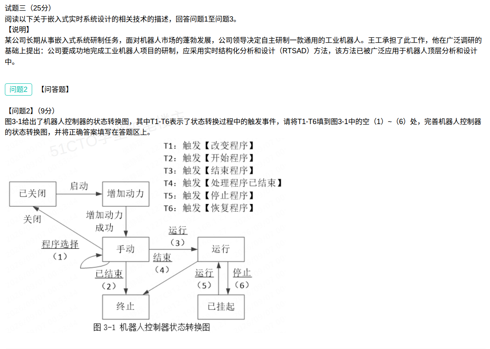

## 嵌入式实时系统状态转换图案例分析题（解答）

本题为**试题三**（25 分），背景是某公司长期从事嵌入式系统研制，面对机器人市场发展，决定采用**实时结构化分析和设计**（RTSAD）方法自主研发一款通用工业机器人，该方法被广泛应用于机器人顶层分析和设计中。（本笔记录入 **问题1、问题2**；**问题3 未提供**。）

### 问题1（9分）：说明环境模型、行为模型、模块耦合和内聚的含义，并从模块独立性角度说明模块设计的基本原则（300字以内）

**参考答案（约 260 字）：**

> 环境模型：用**数据流图（DFD）**描述系统与外部环境（外部实体）之间的数据交互关系，界定系统的边界以及输入/输出。行为模型：用**状态转换图（STD）**描述系统随外部事件和时间变化的行为，即系统状态、触发事件与响应动作之间的转换关系。耦合：**模块之间**相互联系、相互依赖的紧密程度，耦合越弱越好。内聚：**一个模块内部**各元素彼此结合的紧密程度，内聚越高越好。从模块独立性角度，模块设计的基本原则是"**高内聚、低耦合**"：尽量提高模块内聚（争取功能内聚），降低模块间耦合（尽量使用数据耦合），使模块相对独立，从而便于理解、修改、测试和复用。

**四个概念对照：**

| 概念 | 描述对象 | 含义 | 优劣取向 | 常用工具 |
| ---- | ---- | ---- | ---- | ---- |
| 环境模型 | 系统 ↔ 外部环境 | 系统与外部环境的数据交互、系统边界 | —— | 数据流图（DFD） |
| 行为模型 | 系统自身随时间的行为 | 状态、触发事件、响应动作之间的转换 | —— | 状态转换图（STD） |
| 耦合 | **模块之间** | 模块间相互依赖的紧密程度 | **越弱越好** | 模块结构图 |
| 内聚 | **模块内部** | 模块内各元素结合的紧密程度 | **越强越好** | 模块结构图 |

> 记忆主线：**环境模型管"对外交互"、行为模型管"因何事件变何状态"、耦合看"模块之间"、内聚看"模块内部"**；模块设计总原则一句话——**高内聚、低耦合**。

### 问题2（9分）：把触发事件填入状态转换图空 (1)~(6)

题目给出机器人控制器的**状态转换图**（图 3-1），其中 **T1~T6 表示状态转换过程中的触发事件**，要求把 T1~T6 填入图中空 (1)~(6)，完善状态转换图。

六个待填触发事件为：T1 改变程序、T2 开始程序、T3 结束程序、T4 处理程序已结束、T5 停止程序、T6 恢复程序。

**标准答案（按 (1)~(6) 顺序）：T1、T4、T2、T3、T6、T5**

| 空位 | 应填事件 | 触发事件内容 | 对应状态转换（箭头标注） |
| ---- | ---- | ---- | ---- |
| (1) | **T1** | 改变程序 | 手动 ——程序选择——▶ 手动（**自环**） |
| (2) | **T4** | 处理程序已结束 | 手动 ——已结束——▶ 终止 |
| (3) | **T2** | 开始程序 | 手动 ——运行——▶ 运行 |
| (4) | **T3** | 结束程序 | 运行 ——结束——▶ 终止 |
| (5) | **T6** | 恢复程序 | 已挂起 ——运行——▶ 运行 |
| (6) | **T5** | 停止程序 | 运行 ——停止——▶ 已挂起 |

**推理思路（事件语义 ↔ 转移语义一一配对）：**

1. **(1) 手动自环**：箭头从「手动」出发又回到「手动」，标注为"程序选择"。选择/变更程序即"改变程序"，对应 **T1**。
2. **(2) 手动 → 终止**：标注"已结束"，是"程序运行完毕"导致终止，语义为"处理程序已结束"，对应 **T4**。
3. **(3) 手动 → 运行**：标注"运行"，是"启动/开始运行程序"使系统进入运行态，对应 **T2 开始程序**。
4. **(4) 运行 → 终止**：标注"结束"，是"结束程序"使系统终止，对应 **T3**。
5. **(5) 已挂起 → 运行**：标注"运行"，是从挂起态"恢复"运行，对应 **T6 恢复程序**。
6. **(6) 运行 → 已挂起**：标注"停止"，是"停止程序"使系统挂起，对应 **T5**。

**机器人控制器完整状态转换表（便于对照检查）：**

| 序号 | 当前状态 | 触发事件 | 目标状态 |
| ---- | ---- | ---- | ---- |
| 1 | 已关闭 | 启动 | 增加动力 |
| 2 | 增加动力 | 增加动力成功 | 手动 |
| 3 | 手动 | 关闭 | 已关闭 |
| 4 | 手动 | 程序选择（T1 改变程序） | 手动（自环） |
| 5 | 手动 | 已结束（T4 处理程序已结束） | 终止 |
| 6 | 手动 | 运行（T2 开始程序） | 运行 |
| 7 | 运行 | 结束（T3 结束程序） | 终止 |
| 8 | 运行 | 停止（T5 停止程序） | 已挂起 |
| 9 | 已挂起 | 运行（T6 恢复程序） | 运行 |

### 考点小结

**RTSAD（实时结构化分析和设计）要点：**

- RTSAD 是在结构化分析/设计（SA/SD）基础上，面向**实时系统**扩展而来的分析与设计方法，广泛应用于机器人等嵌入式实时系统的**顶层分析和设计**。
- 实时系统建模通常包含三类模型：
  - **环境模型**：描述系统与外部环境的交互（如数据流图 DFD）；
  - **行为模型**：描述系统随**时间 / 事件**变化的行为，核心工具即**状态转换图**（本题考点）；
  - **模块结构**：按**高内聚、低耦合**原则划分模块，衡量模块独立性。
- 三类模型各有侧重：环境模型管"与外部交换什么数据"，行为模型管"何时、因何事件做什么"，模块结构管"如何分而治之"。

**状态转换图（STD）三要素：**

| 要素   | 含义                       | 本题对应                                   |
| ---- | ------------------------ | -------------------------------------- |
| 状态   | 系统在某一时刻所处的状况，用方框表示       | 已关闭、增加动力、手动、运行、终止、已挂起                  |
| 触发事件 | 引起状态转换的外部 / 内部事件，标注在箭头上  | T1~T6（改变 / 开始 / 结束 / 处理已结束 / 停止 / 恢复程序） |
| 转换   | 由事件触发使系统从一个状态迁移到另一状态的箭头  | 如「手动 ——运行——▶ 运行」                       |

- **自环**（如「手动 ——程序选择——▶ 手动」）表示状态不变，但执行了相应动作 / 响应，是状态图常见形式。
- 状态转换图与**状态转换表**等价，可相互转换：表中一行"当前状态 + 触发事件 → 目标状态"即图中一条箭头。
- 起始状态通常用带黑点的箭头（或"启动"事件）标识，「终止」为终态。

**易错点：**

- **"结束程序"与"处理程序已结束"名字相近，极易混填**：T4「处理程序已结束」对应**手动 → 终止**；T3「结束程序」对应**运行 → 终止**。要分清"人主动结束程序"和"程序自己处理完毕"。
- **(5) 与 (6) 不要颠倒**：(5) 是**已挂起 → 运行**（恢复程序 T6），(6) 是**运行 → 已挂起**（停止程序 T5），方向相反。
- **填空要填"事件编号"，不能填"状态名"**：题目要求把 T1~T6 填入图中，箭头旁另行标注的是状态/动作名（如"运行""结束""停止"），不要被标注文字带偏。
- **（1）是自环**：容易漏看「手动」上的自环，误把"程序选择"当成从「已关闭」进入「手动」的转换；本题从「已关闭」进入「手动」的路径是"启动 → 增加动力 → 增加动力成功"。
- 答题顺序建议：先读清**每个转移箭头的起止状态与文字标注**，再把 T1~T6 的**事件语义**与之一一配对，通常可全部命中，无需逐个试错。

**关联复习：**

- 与 [09-嵌入式多核程序设计技术案例分析题-解答.md](09-嵌入式多核程序设计技术案例分析题-解答.md) 对照记忆：同为**嵌入式**题材，05 考 RTSAD 与状态转换图（**分析与设计方法**），09 考多核/多线程程序设计（**体系结构与编程思维**），可一并梳理嵌入式方向考点。
- 环境模型/行为模型的基础可参考知识点位 [01-UML14图.md](../知识点位/01-UML14图.md)（DFD 与状态图均为建模图形，注意区分"数据流"与"状态变迁"两种视角）。
- 模块独立性的应用背景可参考易错题本 [65-负载均衡-分类与集群实现方案.md](../易错题本/65-负载均衡-分类与集群实现方案.md)（"分而治之 + 各单元相对独立"是系统设计的一贯思路）。
