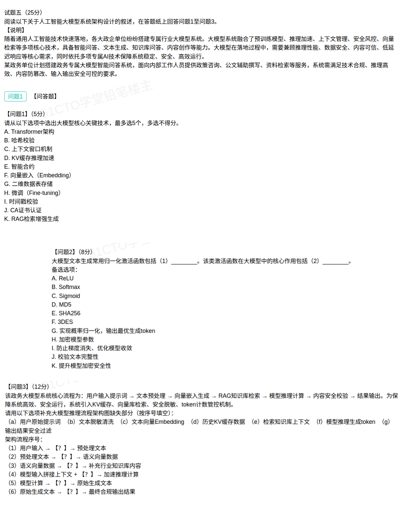

## 人工智能大模型系统架构设计案例分析题（解答）

本题以某政务单位搭建**政务专属大模型智能问答系统**为背景，围绕**大模型核心技术识别**、**归一化激活函数**、**大模型推理框架流程**（含管控机制）三个考点展开，属于"概念识别 + 原理理解 + 流程还原"的综合题。

题干给出的关键信息有两条：

- **大模型融合的核心技术**：预训练模型、推理加速、上下文管理、安全风控、向量检索。
- **系统落地需求**：技术合规、推理高效、内容防篡改、输入输出安全可控；面向内部人员提供政策咨询、公文辅助撰写、资料检索等服务。
- **推理核心流程**：用户输入提示词 → 文本预处理 → 向量嵌入生成 → RAG 知识库检索 → 模型推理计算 → 内容安全校验 → 结果输出；并引入 **KV 缓存、向量库检索、安全脱敏、token 计数管控** 四项机制。

### 问题1（5分）：选出大模型核心关键技术（最多选 5 个）

**参考答案：A、C、D、F、K**（最多选 5 个，多选不得分）

| 选项                    | 判断 | 归类与说明                                                     |
| --------------------- | -- | --------------------------------------------------------- |
| A. Transformer 架构     | 选中 | 大模型的底层网络结构，自注意力机制的基础，对应题干"预训练模型"                           |
| B. 哈希校验               | 排除 | 密码学数据完整性校验手段，属区块链 / 文件校验领域，非大模型核心技术                      |
| C. 上下文窗口机制            | 选中 | 决定模型单次可处理的 token 长度与上下文组织方式，对应"上下文管理"                      |
| D. KV 缓存推理加速          | 选中 | 缓存历史 Key/Value，避免重复计算，对应"推理加速"                            |
| E. 智能合约               | 排除 | 区块链技术，与政务大模型无关                                             |
| F. 向量嵌入 Embedding     | 选中 | 把文本映射为语义向量，是检索、相似度计算的基础，对应"向量检索"                           |
| G. 二维数据表存储            | 排除 | 传统关系型数据库的存储方式，大模型存的是向量、KV 缓存与原始文本，不适用                     |
| H. 微调 Fine-tuning     | 排除 | 属"模型训练 / 优化"环节；题干说明未列入该系统五项核心技术，且本题选项上限为 5 个，故不选        |
| I. 时间戳校验              | 排除 | 密码学防重放 / 时效校验手段，非大模型核心技术                                  |
| J. CA 证书认证            | 排除 | PKI 体系身份认证技术，属网络安全范畴，非大模型核心技术                             |
| K. RAG 检索增强生成         | 选中 | 检索（向量库）+ 生成结合，提升知识准确性与可溯源性，对应"向量检索"                       |

**解题思路：**

1. 先抓题干【说明】里点名的**五类核心技术**——预训练模型、推理加速、上下文管理、安全风控、向量检索，它们就是本题的"答案锚点"。
2. 再按"**是否属于大模型本身的技术**"逐一筛选：B（哈希校验）、E（智能合约）、G（二维数据表存储）、I（时间戳校验）、J（CA 证书认证）都是**其他领域的成熟技术**，只是被拿来当干扰项。
3. H（微调）虽然真实存在，但题干只列举了五类技术，且"最多选 5 个"，与 A / C / D / F / K 正好占满 5 个名额，因此**不选 H**。

> 一句话记忆：**架构（A）+ 上下文（C）+ 推理加速（D）+ 向量（F）+ 检索增强（K）**；凡带"校验 / 认证 / 加密 / 合约 / 数据表"字样的一律排除。

### 问题2（8分）：归一化激活函数及其核心作用

**参考答案：**

- （1）**B. Softmax**
- （2）**G. 实现概率归一化，输出最优生成 token**

**选项分析：**

| 选项                            | 判断 | 说明                                                       |
| ----------------------------- | -- | -------------------------------------------------------- |
| A. ReLU                       | 排除 | 常用激活函数，主要作用是隐藏层引入非线性、缓解梯度消失，不做多分类概率归一化                   |
| B. Softmax                    | 选中 | 把模型输出的 logits 归一化成概率分布，是文本生成时选出下一个 token 的激活函数           |
| C. Sigmoid                    | 排除 | 输出区间 (0,1) 的二分类激活函数，无法在数万级词表上做多分类归一化                    |
| D. MD5                        | 排除 | 哈希摘要算法                                                   |
| E. SHA256                     | 排除 | 哈希摘要算法                                                   |
| F. 3DES                       | 排除 | 对称加密算法                                                   |
| G. 实现概率归一化，输出最优生成 token       | 选中 | 与（1）配套，(2) 问的正是 Softmax 在生成阶段的核心作用                      |
| H. 加密模型参数                    | 排除 | 属密码学范畴，与激活函数无关                                           |
| I. 防止梯度消失、优化模型收敛              | 排除 | 这是 ReLU / Sigmoid 等激活函数在**训练阶段**的作用，不是 Softmax 的归一化作用   |
| J. 校验文本完整性                    | 排除 | 哈希校验的作用，与激活函数无关                                          |
| K. 提升模型加密安全性                  | 排除 | 与激活函数无关                                                  |

**原理展开：**

大模型文本生成本质是**逐 token 的下一个词预测**：模型最后一层会为词表中每个 token 打出一个分数（logit），**Softmax** 把这些分数转成"和为 1"的概率分布，再据此选词（贪心取最大概率，或按温度采样）。因此：

- 问"归一化激活函数"——只有 **Softmax** 具备多分类概率归一化能力（ReLU 无归一化、Sigmoid 只做二分类）。
- 问"核心作用"——即 **概率归一化后输出最优生成 token**（选项 G）。

注意本题有**两组干扰项**：一组是 A / C（其他激活函数），一组是 D / E / F / H / J / K（密码学与加密相关），抓住"归一化 + 生成 token"这条主线即可排除。

### 问题3（12分）：大模型推理框架流程填空

**参考答案：**

| 序号                              | 填空                  | 对应机制 / 环节      | 说明                                    |
| ------------------------------- | ------------------- | ------------- | ------------------------------------- |
| （1）用户输入 → ？ → 预处理文本            | b 文本脱敏清洗            | 安全脱敏          | 对用户原始提示词做敏感信息脱敏与清洗，得到预处理文本            |
| （2）预处理文本 → ？ → 语义向量数据          | c 文本向量 Embedding    | 向量嵌入          | 把预处理文本编码为语义向量，供检索使用                   |
| （3）语义向量数据 → ？ → 补充行业知识库内容       | e 检索知识库上下文          | 向量库检索 / RAG   | 用语义向量在向量库中做相似度检索，召回行业知识上下文            |
| （4）模型输入拼接上下文 + ？ → 加速推理计算      | d 历史 KV 缓存数据        | KV 缓存         | 复用历史 Key/Value，避免重复计算，加速推理             |
| （5）模型计算 → ？ → 原始生成文本           | f 模型推理生成 token      | 模型推理          | 逐 token 生成原始文本                        |
| （6）原始生成文本 → ？ → 最终合规输出结果       | g 输出结果安全过滤          | 内容安全校验 / token 计数管控 | 做内容安全与合规过滤后，输出最终结果                    |

**多余项：a 用户原始提示词。** 因为第（1）空的前置节点已经写明是"用户输入"，(a) 与之语义重复，是干扰项。

**流程串讲（按数据流把 6 空串起来）：**

> 用户输入提示词 → **文本脱敏清洗**（b）→ 预处理文本 → **文本向量 Embedding**（c）→ 语义向量数据 → **检索知识库上下文**（e）→ 补充行业知识库内容 → 模型输入拼接上下文 + **历史 KV 缓存数据**（d）→ 加速推理计算 → **模型推理生成 token**（f）→ 原始生成文本 → **输出结果安全过滤**（g）→ 最终合规输出结果。

**题干四项管控机制与填空的对应关系：**

| 管控机制     | 落点    | 作用                                  |
| -------- | ----- | ----------------------------------- |
| 安全脱敏     | （1）   | 输入侧敏感信息脱敏，满足"输入安全可控"                |
| 向量库检索    | （2）（3）| 语义向量 + 相似度检索，为 RAG 提供行业知识上下文        |
| KV 缓存    | （4）   | 复用历史 Key/Value，降低重复计算，满足"推理高效、低延迟"   |
| token 计数管控 | （5）（6）| 控制生成长度与成本，配合内容安全校验保证"输出安全可控、合规"     |

**易错提醒：** 本题每个空都是"输入 → 【过程 / 数据】→ 输出"的句式，判断时要**同时看前后两端**。例如第（4）空右端是"加速推理计算"，只有"历史 KV 缓存数据"能带来加速效果；第（6）空右端是"最终合规输出结果"，对应"输出结果安全过滤"，不要与"内容安全校验"环节混淆。

### 考点小结

**大模型核心技术（本题命中）：**

| 技术                | 一句话定位                  |
| ----------------- | ---------------------- |
| Transformer 架构    | 大模型底层网络结构，自注意力机制       |
| 上下文窗口机制           | 决定单次可处理的 token 长度      |
| KV 缓存推理加速         | 缓存历史 Key/Value，加速自回归生成 |
| 向量嵌入 Embedding    | 文本 → 语义向量，检索与相似度计算基础   |
| RAG 检索增强生成        | 检索外部知识 + 生成，减少幻觉、可溯源   |
| 微调 Fine-tuning    | 在预训练模型上用领域数据继续训练（本题未列入） |
| Softmax           | 输出概率归一化，选出下一个生成 token  |

**大模型推理全流程（一条主线）：**

> 用户输入 →（安全脱敏清洗）→ 向量嵌入 →（向量库检索 / RAG）→ 拼接上下文 +（KV 缓存）→ 模型推理生成 token →（内容安全过滤）→ 合规输出。

**易错点：**

- 问题1务必看题干【说明】的定语："**预训练模型、推理加速、上下文管理、安全风控、向量检索**"，答案只在这五类里选；哈希校验、智能合约、二维数据表存储、时间戳校验、CA 证书认证都是**跨领域干扰项**。
- 问题1不要因为"微调是真实的大模型技术"就多选 H——选项上限 5 个，题干未列入即不选，**多选不得分**。
- 问题2要区分"激活函数类型"与"激活函数作用"：(1) 问的是**函数名**（Softmax），(2) 问的是**作用**（概率归一化、输出最优生成 token）；不要选成 ReLU / Sigmoid，也不要选"防止梯度消失"（那是训练阶段的事）。
- 问题3是**数据流还原题**：先看每空左右两端的箭头文字，再代入选项读一遍是否通顺，最后检查 7 个选项中剩下哪一个（本题为 a）多余。
- 区分**输入侧安全**（脱敏清洗，对应"输入安全可控"）与**输出侧安全**（内容安全过滤，对应"输出合规"）：两者不是同一个环节，位置分别在流程首尾。
