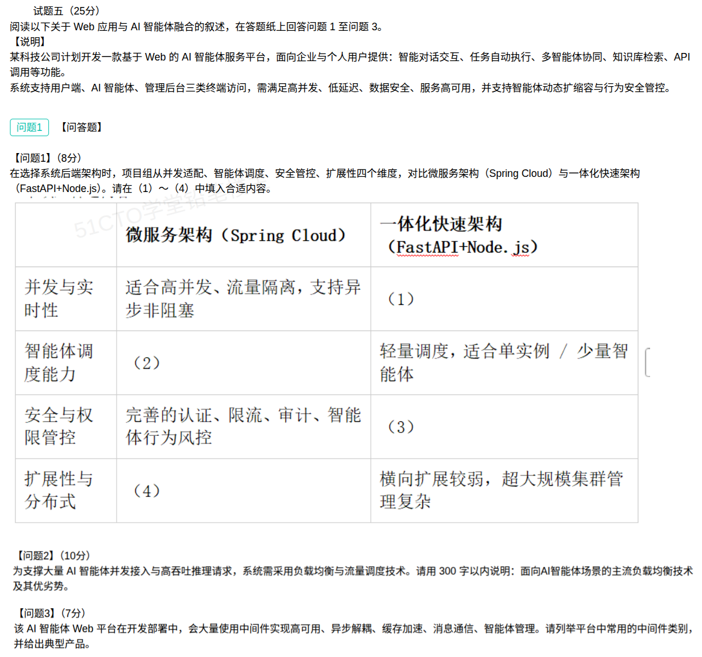

## Web应用与AI智能体融合平台案例分析题（解答）

本题为**试题五**（25 分），围绕基于 Web 的 AI 智能体服务平台，从**后端架构选型对比**（问题1，8 分）、**负载均衡与流量调度技术**（问题2，10 分）、**常用中间件类别与典型产品**（问题3，7 分）三个考点展开。

背景：某科技公司计划开发一款基于 Web 的 AI 智能体服务平台，面向企业与个人用户提供**智能对话交互、任务自动执行、多智能体协同、知识库检索、API 调用**等功能；系统支持**用户端、AI 智能体、管理后台**三类终端访问，需满足高并发、低延迟、数据安全、服务高可用，并支持**智能体动态扩缩容与行为安全管控**。

### 问题1（8分）：后端架构选型对比填空 (1)~(4)

**答案：**

- **（1）** 轻量、启动快、开发迭代快，基于异步事件循环（Node.js 事件循环 / FastAPI 异步）适合 **I/O 密集型的中低并发**场景；单实例并发处理能力有限，**高并发需多实例/集群水平扩展**。
- **（2）** 支持**分布式调度与多智能体协同**，可结合消息队列、注册中心实现**弹性扩缩容与任务编排**，适合大规模智能体集群。
- **（3）** 安全能力较基础，通常只有**简单认证/鉴权**，缺少统一的**限流、审计与智能体行为风控**，需自行集成安全组件。
- **（4）** 支持**服务独立部署与横向扩展**，可按需弹性伸缩、**故障隔离**，适合大规模分布式集群。

**对照表（完整版）：**

| 维度 | 微服务架构（Spring Cloud） | 一体化快速架构（FastAPI+Node.js） |
| --- | --- | --- |
| 并发与实时性 | 适合高并发、流量隔离，支持异步非阻塞 | **（1）轻量启动快，适合中低并发；单实例能力有限，高并发需多实例/集群水平扩展** |
| 智能体调度能力 | **（2）支持分布式调度与多智能体协同，结合消息队列与注册中心弹性扩缩容、任务编排，适合大规模智能体集群** | 轻量调度，适合单实例 / 少量智能体 |
| 安全与权限管控 | 完善的认证、限流、审计、智能体行为风控 | **（3）安全能力较基础，仅有简单认证鉴权，缺少限流、审计与行为风控，需自行集成安全组件** |
| 扩展性与分布式 | **（4）支持服务独立部署与横向扩展，可按需弹性伸缩、故障隔离，适合大规模分布式集群** | 横向扩展较弱，超大规模集群管理复杂 |

**选型思路（本题主线）：**

- 案例要求**高并发、低延迟、动态扩缩容、行为安全管控**，属于典型的**大规模、强治理**场景 → 更契合**微服务架构**；一体化架构胜在**开发快、部署轻**，适合**原型验证 / 中小规模 / 单实例少量智能体**。
- 答题落点：微服务强在**并发隔离、分布式调度、安全管控、弹性扩展**；一体化架构弱在**并发上限、安全治理、横向扩展**，两条主线正好互为对照。

### 问题2（10分）：面向 AI 智能体场景的主流负载均衡技术及其优劣势（300字以内）

**参考答案（约 270 字）：**

> 主流技术及优劣：①**DNS 轮询/加权**：实现简单、可就近接入，但粒度粗、不感知后端负载。②**四层**（LVS、Nginx stream、F5）：按 IP/端口转发，吞吐高、时延低，适合海量并发接入，但不解析应用层内容。③**七层**（Nginx、HAProxy、Envoy、API 网关）：按 URL/Header 路由，支持灰度、限流、会话保持，灵活但性能与配置成本高。④**推理智能调度**（K8s+KServe、vLLM/TGI 网关）：按队列长度、显存、token 负载感知分发，提升 GPU 利用率、支持流式输出，但实现复杂、与推理框架耦合。⑤**一致性哈希**：会话/上下文粘性、缓存命中高，但易产生热点。实战常用四层+七层组合，辅以健康检查、动态权重、熔断限流。

**技术对照：**

| 技术（层次） | 典型产品 | 优势 | 劣势 |
| --- | --- | --- | --- |
| DNS 负载均衡 | DNS 轮询、GSLB | 实现简单、跨地域就近接入 | 粒度粗、缓存导致切换慢、不感知健康与负载 |
| 四层负载均衡 | LVS、F5、Nginx（stream） | 吞吐高、时延低、连接级转发，抗高并发 | 只认 IP/端口，无法按内容路由 |
| 七层负载均衡 | Nginx、HAProxy、Envoy、Spring Cloud Gateway、Kong | 按 URL/Header/权重路由，支持灰度、限流、鉴权、会话保持 | 性能低于四层、配置复杂、额外解析开销 |
| 推理感知调度 | K8s+KServe、vLLM/TGI 网关、Ray Serve | 按队列/显存/token 负载分发，提升 GPU 利用率、支持流式输出 | 实现复杂、与推理框架耦合、通用性差 |
| 一致性哈希 | Nginx、Envoy、Redis Cluster | 会话/上下文粘性，缓存命中率高 | 易产生数据热点、节点增减需再平衡 |

**算法层常用策略**：轮询、加权轮询、随机、最少连接、最短响应时间、一致性哈希；其中**最少连接/最短响应**更适合推理这类**长耗时、负载不均**的请求。

> 记忆主线：**DNS 粗 → 四层快 → 七层灵活 → 推理智能 → 哈希粘性**，AI 智能体场景强调**负载感知（队列/显存/token）+ 流式输出 + 四层与七层组合**。

### 问题3（7分）：平台常用中间件类别与典型产品

**参考答案（按类别列举，答满即得分）：**

| 中间件类别 | 作用（对应题干功能） | 典型产品 |
| --- | --- | --- |
| **反向代理 / 负载均衡 / API 网关** | 高可用入口、流量分发、限流鉴权 | Nginx、HAProxy、Envoy、Kong、Spring Cloud Gateway |
| **消息队列（消息中间件）** | 异步解耦、削峰填谷、任务通信 | Kafka、RabbitMQ、RocketMQ、Pulsar |
| **缓存中间件** | 缓存加速、会话/上下文存储 | Redis、Memcached |
| **服务注册与配置中心 / 分布式协调** | 服务发现、弹性扩缩容、配置管理 | Nacos、Consul、Eureka、ZooKeeper、etcd |
| **RPC / 服务通信框架** | 多智能体与微服务间调用 | gRPC、Dubbo、Spring Cloud OpenFeign |
| **向量数据库 / 检索引擎** | 知识库检索、RAG 语义召回 | Milvus、Qdrant、Chroma、Elasticsearch、PGVector |
| **容器编排 / 调度中间件** | 智能体动态扩缩容与资源调度 | Kubernetes、Docker、KubeSphere |
| **任务调度 / 工作流引擎** | 任务自动执行、多智能体协同编排 | Airflow、Celery、Temporal、XXL-Job |
| **日志、监控与链路追踪** | 高可用观测、故障定位、行为审计 | ELK/EFK、Prometheus+Grafana、SkyWalking、Jaeger |
| **认证授权 / 安全中间件** | 数据安全、统一身份与行为风控 | Keycloak、OAuth2/JWT、Vault |

> 记忆主线：**入口（网关/负载均衡）→ 解耦（消息队列）→ 加速（缓存）→ 治理（注册/配置/调度）→ 检索（向量库）→ 观测（日志监控）→ 安全（认证）**，一条链路覆盖题干"高可用、异步解耦、缓存加速、消息通信、智能体管理"五类需求。

### 考点小结

**两套后端架构对比：**

| 维度 | 微服务架构（Spring Cloud） | 一体化快速架构（FastAPI+Node.js） |
| --- | --- | --- |
| 并发 | 高并发、流量隔离、异步非阻塞 | 轻量、适合中低并发，高并发需多实例 |
| 智能体调度 | 分布式调度、多智能体协同、弹性扩缩容 | 单实例轻量调度，适合少量智能体 |
| 安全管控 | 认证、限流、审计、行为风控完善 | 基础认证鉴权，安全治理需自行补齐 |
| 扩展性 | 服务独立横向扩展、故障隔离 | 横向扩展弱，大规模集群管理复杂 |
| 适用 | 大规模、强治理、生产级平台 | 原型验证、中小规模、快速上线 |

**易错点：**

- 问题1 填空要**维度对应、优劣对称**：微服务项写强项、一体化项写弱项，别把两列内容写反。
- **负载均衡 ≠ 只有轮询**：AI 智能体场景要答出**负载感知调度**（队列长度 / 显存 / token）与**四层+七层组合**，只背 LVS/Nginx 层次不够。
- 问题2 有 **300 字限制**，要**分类分点、点到即止**，写成大段落会被扣分。
- 问题3 要**类别 + 典型产品**成对给，只写产品不写类别或反之都不完整。
- **消息队列（异步解耦）与缓存（加速）不要混答**：前者管削峰填谷与通信，后者管快速读取。
- **向量数据库是本题的新增得分点**：知识库检索 / RAG 场景必须答出向量库（Milvus / Qdrant / Chroma 等）。

**关联复习：**

- 负载均衡细节见易错题本 [65-负载均衡-分类与集群实现方案.md](../易错题本/65-负载均衡-分类与集群实现方案.md)。
- 微服务组件与特征见 [115-微服务架构组件-API网关与服务注册发现.md](../易错题本/115-微服务架构组件-API网关与服务注册发现.md)、[32-微服务系统特征.md](../易错题本/32-微服务系统特征.md)。
- 与 [03-微服务架构案例分析题-解答.md](03-微服务架构案例分析题-解答.md) 对照记忆：后者考"微服务价值 + 网关/注册发现 + 分布式治理"，本题考"架构选型对比 + 负载均衡 + 中间件"。
