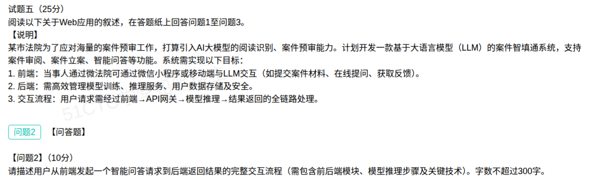

## 法院案件智填通系统案例分析题（解答）

本题为**试题五**（25 分），阅读关于 **Web 应用**的叙述，回答问题1至问题3。题干背景为：某市法院为应对海量案件预审工作，计划引入 **AI 大模型的阅读识别与案件预审能力**，开发一款基于 **LLM 的案件智填通系统**，支持**案件审阅、案件立案、智能问答**等功能。（本笔记录入 **问题2**。）

**系统目标：**

1. **前端**：当事人通过微法院，用**微信小程序或移动端**与 LLM 交互（提交案件材料、在线提问、获取反馈）。
2. **后端**：高效管理**模型训练、推理服务、用户数据存储及安全**。
3. **交互流程**：用户请求需经过**前端 → API 网关 → 模型推理 → 结果返回**的全链路处理。

### 问题2（10分）：从前端发起智能问答到后端返回结果的完整交互流程（300字以内）

**参考答案（约 260 字）：**

> 用户在小程序/移动端发起智能问答，前端完成登录鉴权、输入校验与脱敏，经 HTTPS 调用 API 网关；网关做路由转发、限流、鉴权与身份透传，转至应用服务层。应用服务解析问题，先查缓存并到向量库检索案件知识做检索增强（RAG），组装提示词与上下文，经模型服务网关提交推理服务；推理服务完成分词/嵌入、Prompt 组装、LLM 推理生成与后处理（必要时先 OCR 识别材料），支持流式输出；结果经内容安全审核与格式化后回传应用层；应用层封装答案与引用来源、写库并记录审计日志，最后经网关以 SSE/WebSocket 流式推送前端渲染展示。

**流程分解（按题干"前端 → API 网关 → 模型推理 → 结果返回"主线）：**

| 阶段 | 前端模块 → 后端模块 | 关键动作 |
| --- | --- | --- |
| ① 发起 | 微信小程序 / 移动端 | 登录鉴权、输入校验、敏感信息脱敏，HTTPS 发起问答请求 |
| ② 入口 | **API 网关** | 路由转发、限流、鉴权、身份透传、防重放 |
| ③ 应用层 | 应用服务（微服务） | 解析问题、查缓存、**向量库检索做 RAG**、组装提示词与案件上下文 |
| ④ 推理层 | 模型服务网关 → **推理服务** | 分词/嵌入、Prompt 组装、**LLM 生成**（必要时先 OCR 识别材料）、流式输出 |
| ⑤ 后处理 | 推理服务 → 应用层 | 结果校验、内容安全审核、格式化、引用来源封装 |
| ⑥ 返回 | 应用层 → 网关 → 前端 | 写库、记审计日志，经 **SSE/WebSocket 流式推送**前端渲染 |

**关键技术对照：**

| 环节 | 关键技术 / 典型产品 |
| --- | --- |
| 前端交互 | 微信小程序、移动端、HTTPS/WSS、JWT/OAuth2 鉴权、输入校验与脱敏 |
| 网关入口 | API 网关（Nginx、Kong、Spring Cloud Gateway）：路由、限流、鉴权、身份透传 |
| 应用服务 | 微服务、缓存（Redis）、消息队列（Kafka/RabbitMQ）异步解耦 |
| 检索增强 | **RAG**：向量数据库（Milvus、Qdrant、Chroma）、向量嵌入检索 |
| 模型推理 | 模型服务网关、推理框架（vLLM、TGI、KServe）、Token 化/嵌入、Prompt 组装、LLM 生成、**流式输出** |
| 数据与安全 | OCR 材料识别、内容安全审核、数据库/对象存储、数据加密与权限、审计日志 |
| 运维支撑 | 容器编排（Kubernetes）、监控（Prometheus + Grafana）、日志（ELK） |

> 记忆主线：**前端鉴权脱敏 → 网关路由限流 → 应用检索组装（RAG）→ 模型推理生成（可流式）→ 后处理审核 → 网关流式返回**，一句话串起"前端 → API 网关 → 模型推理 → 结果返回"。

### 考点小结

**易错点：**

- 只答"前端请求 → 后端处理 → 返回结果"过于笼统，必须点出 **API 网关、模型推理服务、流式返回**三类核心模块。
- 有 **300 字限制**，要**分点简答、点到即止**，写成大段落会被扣分。
- 容易漏答关键技术得分点：**RAG/向量库检索、模型服务网关、流式输出（SSE/WebSocket）、内容安全审核**。
- 区分**在线推理交互流程**与**模型训练管理**：问题2 问的是用户提问到返回的在线全链路，模型训练/微调不属于该流程。
- 注意题干已给出主线"前端→API 网关→模型推理→结果返回"，答题应**顺着这条链路逐段展开**，不要漏掉网关环节。

**关联复习：**

- 与 [07-Web应用与AI智能体融合平台案例分析题-解答.md](07-Web应用与AI智能体融合平台案例分析题-解答.md) 对照记忆：后者考"后端架构选型 + 负载均衡 + 中间件"，本题考"智能问答的端到端交互流程"。
- 与 [03-微服务架构案例分析题-解答.md](03-微服务架构案例分析题-解答.md) 对照，理解微服务与网关在链路中的位置。
- 网关、注册发现细节见易错题本 [115-微服务架构组件-API网关与服务注册发现.md](../易错题本/115-微服务架构组件-API网关与服务注册发现.md)。
- 微服务特征见 [32-微服务系统特征.md](../易错题本/32-微服务系统特征.md)。
- 入口负载均衡见 [65-负载均衡-分类与集群实现方案.md](../易错题本/65-负载均衡-分类与集群实现方案.md)。
