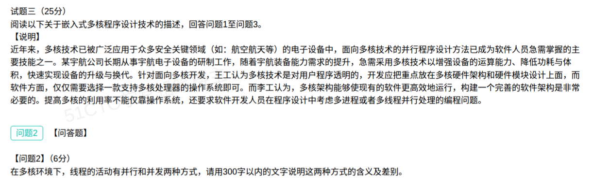
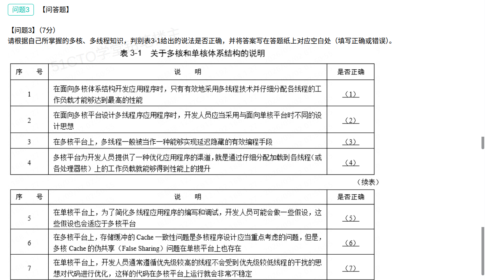

## 嵌入式多核程序设计技术案例分析题（解答）

本题为**试题三**（25 分），阅读关于**嵌入式多核程序设计技术**的叙述，回答问题1至问题3。题干背景：某宇航公司长期从事宇航电子设备的研制工作，随着宇航装备能力需求提升，急需采用**多核技术**以增强设备的运算能力、降低功耗与体积，快速实现设备的升级与换代。针对面向多核开发，**王工**认为多核技术对用户程序是透明的，开发应把重点放在**多核硬件架构和硬件模块设计**上，软件方面仅需选择一款支持多核处理器的操作系统即可；**李工**认为多核架构能使现有软件更高效地运行，构建一个完善的**软件架构**非常必要，提高多核的利用率不能仅靠操作系统，还要求软件开发人员在程序设计中考虑**多进程或者多线程并行处理**的编程问题。（本笔记录入 **问题2、问题3**；**问题1（12分，什么是多核技术和多线程技术、李工意见是否正确及为什么）未提供**。）

### 问题2（6分）：多核环境下线程"并行"与"并发"两种方式的含义及差别（300字以内）

**参考答案（约 290 字）：**

> 并发是指系统在**同一时间段内**能够"同时存在"多个线程，这些线程**交替占用 CPU**、宏观上一起向前推进、微观上仍是串行执行，单核处理器靠时间片轮转即可实现。并行是指系统在**同一时刻**有**两个或两个以上线程真正同时运行**，微观上也是同时执行的，必须由多核（或多个处理部件）提供硬件支持。二者的差别在于：并发强调"同时存在、交替执行"，是**逻辑上的同时**，单核也能做到；并行强调"同时执行"，是**物理上的同时**，必须有多个处理核。多核环境下两者并存：同一时刻只有一个线程在运行、其余处于就绪时表现为并发，同一时刻多个线程同时运行时表现为并行；并行能真正缩短计算时间，并发主要提高响应能力与资源利用率。

**并发 vs 并行对照：**

| 维度 | 并发（Concurrency） | 并行（Parallelism） |
| --- | --- | --- |
| 核心含义 | 多个线程**同时存在**、交替使用 CPU | 多个线程**同时执行** |
| 时间视角 | 宏观同时、**微观串行**（分时交替） | 宏观、**微观都同时** |
| 硬件要求 | 单核即可实现（时间片轮转） | 必须多核 / 多处理部件 |
| 本质 | 逻辑上的"同时" | 物理上的"同时" |
| 主要目的 | 提高**响应能力与资源利用率** | 缩短**计算时间**、提高**吞吐量** |

> 通俗比喻（易记）：吃饭时电话来了——吃完再接＝既不并发也不并行；停下吃饭去接电话、接完继续吃＝**并发**；一边吃饭一边打电话＝**并行**。
>
> 记忆主线：**并发＝交替执行（单核可实现，逻辑同时）；并行＝真正同时（须多核，物理同时）**。

### 问题3（7分）：判别表3-1关于多核和单核体系结构的说法是否正确

**官方答案（按 (1)~(7) 顺序）：正确、正确、错误、正确、错误、错误、正确**

| 序号 | 说法要点 | 判断 | 依据 |
| --- | --- | --- | --- |
| (1) | 面向多核开发时，**只有**有效采用多线程技术并仔细分配各线程工作负载**才能**达到最高性能 | **正确** | 多核资源要被充分利用，必须把可并行的工作拆成多线程并**均衡分摊到各核**；否则多数核闲置，达不到高性能。 |
| (2) | 面向多核平台设计多线程程序应采用与单核平台**不同的设计思想** | **正确** | 单核多线程重在减少切换开销、隐藏延迟；多核则要考虑**并行分解、数据划分、负载均衡、避免伪共享、同步开销**等，设计思想确实不同。 |
| (3) | 在多核平台上，多线程**一般被当作实现延迟隐藏**的有效编程手段 | **错误** | **延迟隐藏**（用其他线程填补某线程等待 I/O/内存的时间）是**单核平台**上多线程的典型动机；多核平台上多线程的主要目的是**并行计算、充分利用多核缩短计算时间**。 |
| (4) | 多核平台提供了一种优化应用程序的渠道，就是通过**仔细分配各线程（各核）工作负载**就能获得性能提升 | **正确** | 把工作负载均衡地分配到各线程/各核，是把多核能力转化为性能提升的**关键渠道**（多核编程最重要的一点就是计算量在各核间均匀分摊）。 |
| (5) | 单核平台上为简化多线程编写调试所做的一些假设，**也会适应于**多核平台 | **错误** | 单核上的简化假设（如"同一时刻只有一个线程真正运行"、共享资源可独占等）在多核上**不再成立**，会引发竞态、优先级反转等问题。 |
| (6) | 多核 Cache 的**伪共享（False Sharing）**问题在**单核平台上也存在** | **错误** | 伪共享源于**多个核各自独立的 Cache** 对同一 Cache 行的竞争与一致性维护（MESI 等）；单核只有一个核，**不存在核间 Cache 一致性问题**，故不存在伪共享。 |
| (7) | 单核上"优先级较高的线程不会受优先级较低线程干扰"的优化代码，在多核平台上运行会**非常不稳定** | **正确** | 单核串行调度下高优先级线程通常不会被低优先级线程打断；多核上多线程**真正并行**，低优先级线程可能占住锁/Cache 等共享资源反过来拖累高优先级线程，产生**优先级反转/干扰**，使程序不稳定。 |

**推理要点（用"单核 vs 多核"这条轴判断）：**

1. 含"**只有…才能 / 就是通过…就能**"却把多核性能**说得到位**的（(1)(2)(4)），判**正确**——它们正是李工"要重视多核并行编程与负载分配"的观点。
2. 把**单核才成立**的特性错安到多核上（(3) 延迟隐藏）、或把**多核才存在**的问题错说成单核也有（(6) 伪共享），判**错误**。
3. 把**单核的简化假设**推广到多核（(5)），或指出**单核优化在多核会失效**（(7)），前者错、后者对。

### 考点小结

**核心概念：**

| 概念 | 含义 | 关键点 |
| --- | --- | --- |
| 并发 | 多线程在同一**时间段**内同时存在、交替执行 | 单核可实现，逻辑上的同时 |
| 并行 | 多线程在同一**时刻**真正同时执行 | 必须多核，物理上的同时 |
| 多核技术 | 将两个或多个独立处理器核封装集成在一个芯片（硅核）中 | 操作系统把每个核当作分立的逻辑处理器，靠**任务划分**在核间并行 |
| 多线程技术 | 软/硬件上实现多个线程并发执行的技术 | 线程创建/切换开销小于进程、通信更简单，是多核编程首选形式 |
| 延迟隐藏 | 用其他可运行线程填补某线程等待 I/O/内存的时间 | **单核**多线程的典型动机（提高响应速度） |
| 伪共享 | 多个核改同一 Cache 行中的不同变量，触发该行在各核间反复失效/迁移 | **只在多核**存在，是 Cache 一致性开销，可用填充/对齐缓解 |

**易错点：**

- **并发≠并行**：最容易混。判据是"**是否同一时刻真正同时执行**"——同时存在是并发，同时执行才是并行；单核只能并发、不能并行。
- **延迟隐藏属于"单核"**：见到"多核平台上多线程是为了延迟隐藏"要判**错误**；多核多线程的目标是**并行、缩短计算时间**。
- **伪共享只在多核存在**：题干把伪共享说成单核也有，判**错误**；单核没有核间 Cache 一致性问题。
- **不要被"只有…才能""就是…"这类绝对措辞带偏**：(1)(4) 虽措辞绝对，但符合多核"必须并行+负载均衡"的事实，官方判**正确**；要按**知识本身**判断，而非只看措辞。
- **单核经验不能照搬到多核**：(5)(7) 考查的正是"单核假设/优化在多核失效"，注意区分"假设会适应多核"（错）与"单核代码在多核不稳定"（对）。
- 问题2 有 **300 字限制**，要**先给定义、再讲差别、最后落到"同时存在 vs 同时执行"**，不要写成大段散文。

**关联复习：**

- 与 [05-嵌入式实时系统状态转换图案例分析题-解答.md](05-嵌入式实时系统状态转换图案例分析题-解答.md) 对照记忆：同为**嵌入式**题材，05 考 RTSAD 与状态转换图（分析与设计方法），本题考**多核/多线程程序设计**（体系结构 + 编程思维），可一并梳理嵌入式方向考点。
- 与 [08-法院案件智填通系统案例分析题-解答.md](08-法院案件智填通系统案例分析题-解答.md) 对照：同为"只提供部分问题"的真题，本笔记沿用"**逐问解答 + 对照表 + 记忆主线**"的整理方式。
- 负载分配/均衡的应用背景可参考易错题本 [65-负载均衡-分类与集群实现方案.md](../易错题本/65-负载均衡-分类与集群实现方案.md)（多核是"核间负载均衡"，集群是"节点间负载均衡"，思想相通）。
- 流水线并行的基础概念可参考 [21-五级流水线-阶段功能辨析.md](../易错题本/21-五级流水线-阶段功能辨析.md)（指令级并行 vs 线程级并行，注意区分层次）。
