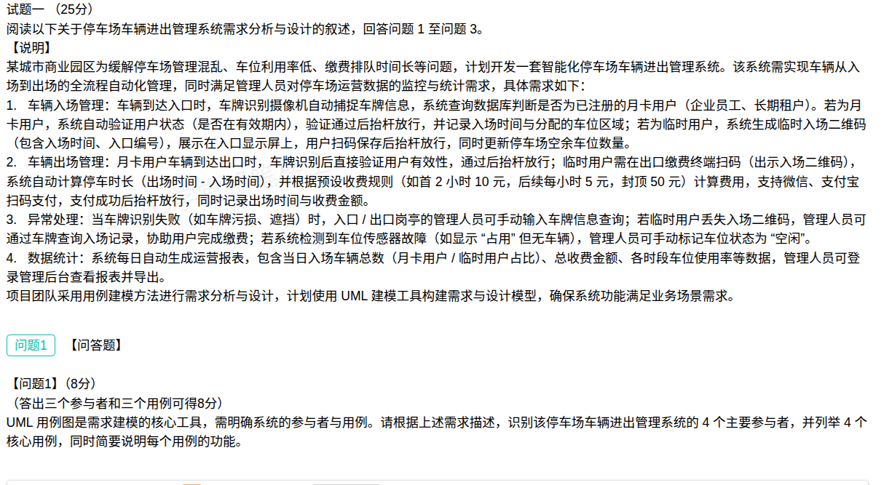

## 停车场车辆进出管理系统案例分析题（解答）

本题为**试题一**（25 分），阅读关于**停车场车辆进出管理系统需求分析与设计**的叙述，回答问题1至问题3。题干背景：某城市商业园区为缓解**停车场管理混乱、车位利用率低、缴费排队时间长**等问题，计划开发一套**智能化停车场车辆进出管理系统**，实现车辆从入场到出场的**全流程自动化管理**，同时满足管理人员对停车场**运营数据的监控与统计**需求。项目团队采用**用例建模方法**进行需求分析与设计，计划使用 **UML 建模工具**构建需求与设计模型。（本笔记录入 **问题1、问题2、问题3**。）

**需求要点：**

1. **车辆入场管理**：车牌识别摄像机自动捕捉车牌信息，系统查询数据库判断是否为已注册的**月卡用户**（企业员工、长期租户）。月卡用户校验状态（是否在有效期内），通过后抬杆放行，记录入场时间与分配的车位区域；临时用户则系统生成**临时入场二维码**（含入场时间、入口编号），显示在入口显示屏上，扫码保存后抬杆放行，并更新停车场空余车位数量。
2. **车辆出场管理**：月卡用户到达出口时，车牌识别后直接验证用户有效性，通过后抬杆放行；临时用户需在出口**缴费终端扫码**（出示入场二维码），系统自动计算停车时长（出场时间 − 入场时间），并按预设收费规则（首 2 小时 10 元，后续每小时 5 元，封顶 50 元）计算费用，支持**微信、支付宝**扫码支付，支付成功后抬杆放行，同时记录出场时间与收费金额。
3. **异常处理**：车牌识别失败（如车牌污损、遮挡）时，入口/出口岗亭的**管理人员**可手动输入车牌信息查询；临时用户丢失入场二维码，管理人员可通过车牌查询入场记录，协助用户完成缴费；系统检测到车位传感器故障（如显示"占用"但无车辆），管理人员可手动标记车位状态为"空闲"。
4. **数据统计**：系统每日自动生成**运营报表**，含当日入场车辆总数（月卡用户/临时用户占比）、总收费金额、各时段车位使用率等数据，管理人员可登录管理后台查看报表并导出。

### 问题1（8分）：识别该系统的4个主要参与者，并列举4个核心用例，简要说明每个用例的功能

**参考答案（答出三个参与者和三个用例可得 8 分）：**

**（1）4 个主要参与者：**

| 参与者 | 类型 | 说明 |
| --- | --- | --- |
| **月卡用户** | 人（主要业务人员） | 已注册的企业员工、长期租户，凭有效月卡身份进出停车场 |
| **临时用户** | 人（主要业务人员） | 未注册月卡的临时停车用户，凭临时入场二维码进出并缴费 |
| **停车场管理人员** | 人（系统操作人员） | 负责异常处理（手动录入车牌、协助缴费、标记车位）及查看导出运营报表 |
| **第三方支付系统** | 外部系统 | 微信、支付宝等支付平台，为临时用户提供扫码支付服务 |

> 注：车牌识别摄像机、车位传感器等设备属于系统的**输入采集部件**，通常不作为参与者；参与者一般指**人**和**与本系统交互的外部系统**。若把支付平台并入系统内部，则参与者为前三者，但题干要求 4 个，故应包含**支付系统**这一外部系统。

**（2）4 个核心用例：**

| 用例 | 主要参与者 | 功能说明 |
| --- | --- | --- |
| **入场管理** | 月卡用户、临时用户 | 车牌识别并查询判断用户类型；月卡用户校验有效期后抬杆放行并记录入场时间与车位区域，临时用户生成临时入场二维码、扫码后放行并更新空余车位数 |
| **出场管理（含计费缴费）** | 月卡用户、临时用户、第三方支付系统 | 车牌识别验证；月卡用户直接放行，临时用户按停车时长计费并通过微信/支付宝扫码支付，支付成功后抬杆放行并记录出场时间与收费金额 |
| **异常处理** | 停车场管理人员 | 识别失败时手动录入车牌查询，协助丢失二维码的用户缴费，对传感器故障车位手动标记为"空闲" |
| **数据统计** | 停车场管理人员 | 每日自动生成运营报表（入场车辆总数、月卡/临时占比、总收费金额、各时段车位使用率），支持查看与导出 |

> 记忆主线：**参与者＝"两类用户 + 管理人员 + 支付系统"；用例＝"进、出、异常、统计"四件事**，正好对应题干四条需求。

### 问题2（12分）：顺序图与交互图（协作图）的核心区别，以及顺序图的4种核心元素

**（1）顺序图与交互图（协作图）的核心区别（约 150 字）：**

> 二者都用于描述对象之间的**动态交互（消息传递）**，语义等价、可互相转换，区别在于**侧重点与布局**：顺序图**强调消息的时间顺序**，以纵向时间轴自上而下排列消息，对象横向排列，能直观看出交互的先后次序，适合表达一个场景的时序细节；协作图（通信图）**强调对象之间的组织结构（链接关系）**，没有时间轴，对象按拓扑关系摆放，消息用**编号**标出先后顺序，适合展示交互对象的整体连接结构。

**顺序图 vs 协作图对照：**

| 维度 | 顺序图（序列图） | 协作图（通信图） |
| --- | --- | --- |
| 侧重点 | **时间顺序** | **对象间的结构/链接关系** |
| 表现形式 | 纵向时间轴，消息自上而下 | 无时间轴，对象按拓扑摆放 |
| 顺序表达 | 位置（上下）即先后 | 消息**编号**表示先后 |
| 适用场景 | 表达单个场景的交互时序细节 | 表达交互对象的整体组织结构 |
| 关系 | 二者**语义等价，可相互转换**，描述的都是对象间的消息交互 | 同左 |

**（2）顺序图包含的 4 种核心元素及其作用：**

| 元素 | 作用 |
| --- | --- |
| **对象（Object）** | 参与交互的对象（含参与者实例），置于图顶部，是消息的发送者与接收者 |
| **生命线（Lifeline）** | 每个对象下方的**垂直虚线**，表示对象在交互过程中**存在的时间段** |
| **激活（执行/控制焦点）** | 生命线上的**矩形条**，表示对象**正在执行操作**的时间段（处理消息的时长） |
| **消息（Message）** | 对象之间传递的**通信**，用带箭头的线表示，方向即发送/接收方向，含同步消息、异步消息、返回消息 |

> 记忆主线：**对象（谁）→ 生命线（在多久）→ 激活（何时在干活）→ 消息（彼此说了什么）**，四要素串起"时间轴上的对象交互"。

### 问题3（5分）：构建用例模型包含的步骤

**参考答案（约 120 字）：**

> 构建用例模型一般包含以下步骤：①**确定系统边界**，明确系统做什么、不做什么；②**识别参与者**，找出所有与系统交互的人员和外部系统；③**识别用例**，为每个参与者找出其参与的系统功能，形成用例；④**明确用例之间的关系**（包含 include、扩展 extend、泛化）并适当精化粒度；⑤**绘制用例图**，在图中展示参与者、用例及关系；⑥**编写用例规约（用例描述）**，对每个用例的事件流、前置/后置条件、异常流进行说明；⑦**评审与确认**，与用户核对后完善模型。

**步骤速记：**

| 序号 | 步骤 | 关键动作 |
| --- | --- | --- |
| ① | 确定系统边界 | 划清系统职责范围 |
| ② | 识别参与者 | 找全人员与外部系统（两类用户、管理人员、支付系统） |
| ③ | 识别用例 | 每个参与者对应的系统功能（进、出、异常、统计） |
| ④ | 明确用例关系 | include / extend / 泛化，理清用例粒度 |
| ⑤ | 绘制用例图 | 用例图可视化参与者—用例—关系 |
| ⑥ | 编写用例规约 | 描述事件流、前置/后置条件、异常流 |
| ⑦ | 评审与确认 | 与用户核对并迭代完善 |

> 记忆主线：**定边界 → 找参与者 → 找用例 → 理关系 → 画图 → 写规约 → 评审**。

### 考点小结

**核心概念：**

| 概念 | 含义 | 关键点 |
| --- | --- | --- |
| 参与者（Actor） | 与系统交互的人或外部系统 | 是**人**或**外部系统**，不是系统内部部件；用小人表示 |
| 用例（Use Case） | 系统提供的一项**完整功能** | 必须对参与者产生**可观察的结果**，用椭圆表示 |
| 用例图 | 描述系统对外的**功能视图** | 需求分析阶段使用，展示参与者、用例及关系 |
| 顺序图（序列图） | 按**时间顺序**排列的对象消息交互 | 有纵向时间轴，消息自上而下 |
| 协作图（通信图） | 强调对象**组织结构**的消息交互 | 无时间轴，消息用**编号**表示顺序；与顺序图语义等价 |
| 用例关系 | 参与者—用例的关联、用例间的**包含/扩展/泛化** | 包含＝必经子流程；扩展＝可选/异常分支；泛化＝特化 |

**易错点：**

- **参与者 ≠ 系统内部模块**：车牌识别摄像机、车位传感器是系统的**输入采集部件**，不能算参与者；参与者是**人（月卡/临时用户、管理人员）和外部系统（支付平台）**。
- **用例必须"对参与者有可观察结果"**：不要把系统内部的处理步骤（如"查询数据库""计算费用"）单独画成用例，它们是**用例内部的活动**。
- **顺序图 vs 协作图**：最容易混。判据是"**强调时间顺序（顺序图）还是强调结构关系（协作图）**"；两者**语义等价、可互转**，别答成"功能不同"。
- **顺序图的核心元素要答全**：对象、生命线、激活（执行说明）、消息——漏掉**激活**或把**生命线**说成"对象本身"都会失分。
- **构建用例模型的步骤要成体系**：核心是"**先定边界 → 再找参与者 → 再找用例 → 理关系 → 画图 → 写规约 → 评审**"，不要只答"画用例图"一步。
- 术语对照：顺序图/序列图、协作图/通信图是**同一事物的不同译名**，答题时按题干用语（顺序图、协作图）作答。

**关联复习：**

- UML 十四种图与图的选择方法见知识点位 [01-UML14图.md](../知识点位/01-UML14图.md)；其中"序列图"即本题的**顺序图**，"通信图"即本题的**协作图**。
- 用例模型与分析模型的区别、用例建模过程可参考易错题本 [50-面向对象-用例模型与分析模型辨析.md](../易错题本/50-面向对象-用例模型与分析模型辨析.md)。
- UML 基本构造块（事物、关系、图）辨析见 [102-UML基本构造块-图与关系辨析.md](../易错题本/102-UML基本构造块-图与关系辨析.md)。
- 用例的**包含（include）与扩展（extend）**关系依赖本质见 [98-UML关系-包含与扩展的依赖本质.md](../易错题本/98-UML关系-包含与扩展的依赖本质.md)。
- 用例实现与交互图（顺序图/协作图）在设计阶段的用法见 [63-面向对象设计-设计用例实现方案-交互图与精化类图.md](../易错题本/63-面向对象设计-设计用例实现方案-交互图与精化类图.md)。
- 面向对象分析的建模过程见 [31-面向对象分析-建模过程.md](../易错题本/31-面向对象分析-建模过程.md)。
- 与 [05-嵌入式实时系统状态转换图案例分析题-解答.md](05-嵌入式实时系统状态转换图案例分析题-解答.md) 对照记忆：同属**需求分析建模**题材，05 考 RTSAD 的 DFD/STD，本题考 UML 的**用例建模与交互图**，可一并梳理建模方法考点。
