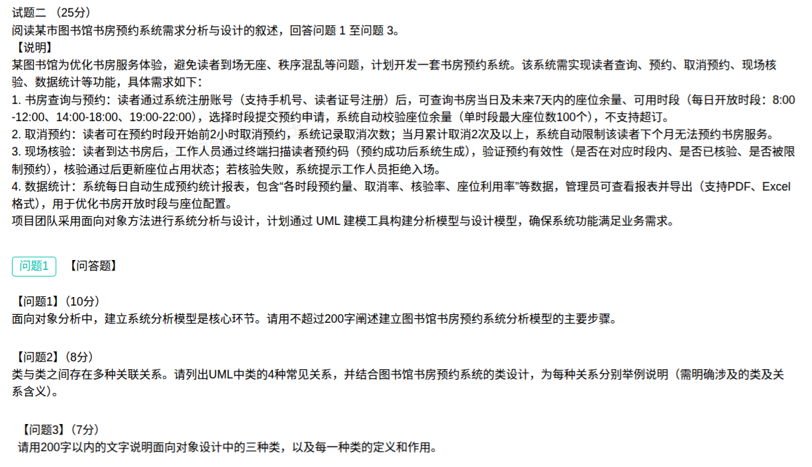
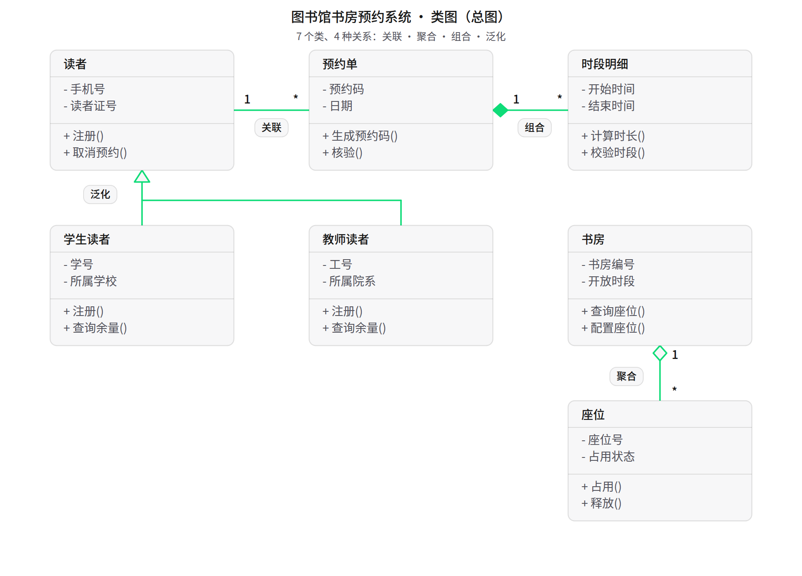

## 图书馆书房预约系统案例分析题（解答）

本题为**试题二**（25 分），阅读关于**图书馆书房预约系统需求分析与设计**的叙述，回答问题1至问题3。题干背景：某图书馆为优化书房服务体验，避免读者**到场无座、秩序混乱**等问题，计划开发一套**书房预约系统**，实现读者查询、预约、取消预约、现场核验、数据统计等功能。项目团队采用**面向对象方法**进行系统分析与设计，计划通过 **UML 建模工具**构建分析模型与设计模型。三问依次考查：**分析建模步骤（10 分）→ UML 类间关系（8 分）→ 设计中的三种类（7 分）**。

**需求要点：**

1. **书房查询与预约**：读者通过系统注册账号（支持**手机号、读者证号**注册）后，可查询书房当日及未来 **7 天内**的座位余量、可用时段（每日开放时段：**8:00-12:00、14:00-18:00、19:00-22:00**），选择时段提交预约申请，系统自动校验**座位余量**（单时段最大座位数 **100 个**），**不支持超订**。
2. **取消预约**：读者可在预约时段**开始前 2 小时**取消预约，系统记录取消次数；当月累计取消 **2 次及以上**，系统自动限制该读者**下个月无法预约**书房服务。
3. **现场核验**：读者到达书房后，工作人员通过终端**扫描读者预约码**（预约成功后系统生成），验证预约有效性（是否在对应时段内、是否已核验、是否被限制预约），核验通过后更新**座位占用状态**；若核验失败，系统提示工作人员**拒绝入场**。
4. **数据统计**：系统每日自动生成**预约统计报表**，包含"各时段预约量、取消率、核验率、座位利用率"等数据，管理员可查看报表并导出（支持 **PDF、Excel** 格式），用于优化书房开放时段与座位配置。

### 问题1（10分）：建立图书馆书房预约系统分析模型的主要步骤（不超过 200 字）

**参考答案（约 180 字）：**

> ①**需求分析**：明确查询、预约、取消、核验、统计等功能需求与非功能需求；②**建立用例模型**：识别读者、工作人员、管理员等参与者及对应用例，绘制用例图；③**建立类模型**：抽象读者、书房、时段、座位、预约单、报表等类，确定其属性、操作与类间关系，绘制类图；④**建立动态模型**：用时序图、活动图描述预约与核验的交互流程，用状态图描述预约单的状态变化；⑤**模型验证与迭代**：检查模型与需求的一致性，反复修改完善。

**步骤—产出对照：**

| 序号 | 步骤 | 主要产出 |
| --- | --- | --- |
| ① | 需求分析 | 需求规格（功能 + 非功能） |
| ② | 建立用例模型 | 用例图（参与者、用例及关系） |
| ③ | 建立类模型（静态） | 类图（类、属性、操作、类间关系） |
| ④ | 建立动态模型 | 时序图、活动图、状态图 |
| ⑤ | 模型验证与迭代 | 评审意见与完善后的模型 |

> 记忆主线：**理需求 → 画用例图 → 画类图 → 画动态图 → 评审迭代**，即"**从需求到静态结构再到动态行为**"。

### 问题2（8分）：UML 中类的 4 种常见关系并结合本系统举例

**参考答案：**

UML 中类的 4 种常见关系为**关联、聚合、组合、泛化**（若按 UML 标准四分法，也可答**依赖、关联、泛化、实现**），结合本系统举例如下：

| 关系 | 涉及类举例 | 关系含义 |
| --- | --- | --- |
| **关联（Association）** | 读者 — 预约单 | 一名读者可拥有多张预约单，两类之间存在**稳定的引用联系**（可标多重性 1 : \*） |
| **聚合（Aggregation）** | 书房 — 座位 | 座位是书房的**组成部分**，但可独立存在（书房停用后座位可重新分配），是**弱"整体—部分"关系**，用**空心菱形**表示 |
| **组合（Composition）** | 预约单 — 时段明细 | 时段明细随预约单的**创建而产生、取消而销毁**，二者**生命周期一致**，是**强"整体—部分"关系**，用**实心菱形**表示 |
| **泛化（Generalization）** | 读者 — 学生读者 / 教师读者 | 子类**继承**父类的属性与操作，是"**一般—特殊**"关系，用**空心三角箭头**指向父类 |

> 记忆主线：**关联＝有联系；聚合＝弱整体-部分（空心菱形）；组合＝强整体-部分（实心菱形）；泛化＝继承（空心三角）**。
>
> 区分关键：聚合与组合都表示"整体—部分"，判据是**部分能否脱离整体独立存在**（能→聚合；不能、同生共死→组合）。

**四种关系类图总图：**

### 问题3（7分）：面向对象设计中的三种类及其定义和作用（不超过 200 字）

**参考答案（约 190 字）：**

> 面向对象设计中的三种类为**实体类、边界类、控制类**。①**实体类**：表示系统中需要**持久保存**的业务对象，如读者、书房、预约单。作用：**承载业务数据及相关业务逻辑**。②**边界类**：表示系统与外部**参与者交互的界面**，如读者预约界面、工作人员核验终端、管理员报表界面。作用：负责**输入输出**，隔离系统内外。③**控制类**：表示**用例的业务控制逻辑**，如预约控制类、核验控制类、统计控制类。作用：**协调边界类与实体类**，完成业务流程的处理。三者相互配合，实现系统的高内聚、低耦合。

**三类对照：**

| 类型 | 定义 | 作用 | 本系统示例 |
| --- | --- | --- | --- |
| **实体类** | 需持久保存的业务对象 | 承载业务数据与业务逻辑 | 读者、书房、时段、预约单、报表 |
| **边界类** | 系统与参与者交互的界面 | 负责输入输出、隔离内外 | 读者预约界面、员工核验终端、管理员报表界面 |
| **控制类** | 用例的业务控制逻辑 | 协调边界与实体、完成用例流程 | 预约控制类、核验控制类、统计控制类 |

> 记忆主线：**实体类管"数据"、边界类管"界面"、控制类管"流程"**，即 MVC/BCE 中 **E（Entity）— B（Boundary）— C（Control）** 三类。

### 考点小结

**核心概念：**

| 概念 | 含义 | 关键点 |
| --- | --- | --- |
| 分析模型 | 面向对象分析阶段建立的模型，反映**问题域**的结构与行为 | 关注"做什么"，不涉及实现；由用例模型 + 类模型 + 动态模型构成 |
| 用例模型 | 描述系统对外的**功能视图** | 需求分析阶段使用，含参与者、用例及关系 |
| 类模型 | 描述系统的**静态结构** | 类、属性、操作及类间关系，用类图表示 |
| 关联 | 类之间的一般**结构联系** | 最弱且最常用，可用多重性标注数量关系 |
| 聚合 | **弱**"整体—部分"关系 | 部分可**独立存在**，空心菱形，菱形指向整体 |
| 组合 | **强**"整体—部分"关系 | 部分与整体**同生共死**，实心菱形 |
| 泛化 | **一般—特殊**（继承）关系 | 子类继承父类属性与操作，空心三角指向父类 |
| 实体类 | 需持久化的业务对象类 | 管数据，对应数据库中的实体 |
| 边界类 | 系统与外界交互的界面类 | 管界面/输入输出，隔离系统内外 |
| 控制类 | 处理用例业务逻辑的协调类 | 管流程，衔接边界类与实体类 |

**易错点：**

- **聚合 vs 组合**：最易混。判据是"**部分能否脱离整体独立存在**"——能独立（如座位）→ **聚合**（空心菱形）；不能、与整体同生共死（如预约单的时段明细）→ **组合**（实心菱形）。菱形的**空心/实心**别记反。
- **关联的方向别丢**：聚合/组合的菱形**指向"整体"一端**，泛化的空心三角**指向"父类"**，画错方向要扣分。
- **问题1 要成体系**：不能只答"画用例图"一步，须体现"**需求分析 → 用例模型 → 类模型 → 动态模型 → 验证迭代**"的完整链条，并落到本系统（读者、书房、预约、核验等）。
- **问题3 别把"三种类"答成"三类设计模式"或"三种继承"**：标准答案是 **实体类、边界类、控制类**（BCE），要**先写定义再写作用**，并各举本系统的例子。
- **字数限制要遵守**：问题1、问题3 均限 **200 字以内**，问题2 未限字数但要**列全 4 种关系并逐一举例**（须明确类与关系含义）。
- **四种类关系的"标准四分法"**：UML 教科书通常指**依赖、关联、泛化、实现**；而题目说"类与类之间"更常考**关联、聚合、组合、泛化**。答题时按题干语境选一组，**举例如要贴合本系统**即可，不必纠结序号。

**关联复习：**

- 面向对象分析建模的完整过程见易错题本 [31-面向对象分析-建模过程.md](../易错题本/31-面向对象分析-建模过程.md)。
- 泛化与聚合关系的判别见 [30-面向对象-泛化与聚合关系.md](../易错题本/30-面向对象-泛化与聚合关系.md)，类关系耦合强度排序见 [37-面向对象-类关系耦合强度排序.md](../易错题本/37-面向对象-类关系耦合强度排序.md)。
- 设计中的三种类（实体/边界/控制）见 [85-面向对象-设计类三类型与订单状态图.md](../易错题本/85-面向对象-设计类三类型与订单状态图.md)——与本题问题3 高度同源。
- 用例模型与分析模型的辨析见 [50-面向对象-用例模型与分析模型辨析.md](../易错题本/50-面向对象-用例模型与分析模型辨析.md)。
- UML 基本构造块（事物、关系、图）辨析见 [102-UML基本构造块-图与关系辨析.md](../易错题本/102-UML基本构造块-图与关系辨析.md)；六种关系的图示记法见 [117-UML类图六种关系图示记法.png](../images/117-UML类图六种关系图示记法.png)。
- 设计阶段"用例实现方案（交互图 + 精化类图）"见 [63-面向对象设计-设计用例实现方案-交互图与精化类图.md](../易错题本/63-面向对象设计-设计用例实现方案-交互图与精化类图.md)。
- UML 十四种图以"序列图/通信图"命名见知识点位 [01-UML14图.md](../知识点位/01-UML14图.md)。
- 与 [10-停车场车辆进出管理系统案例分析题-解答.md](10-停车场车辆进出管理系统案例分析题-解答.md) 对照记忆：同属**面向对象/用例建模**题材，10 考参与者、用例与顺序图，本题考**分析建模步骤、类间关系与三种设计类**，可一并梳理面向对象建模考点。
