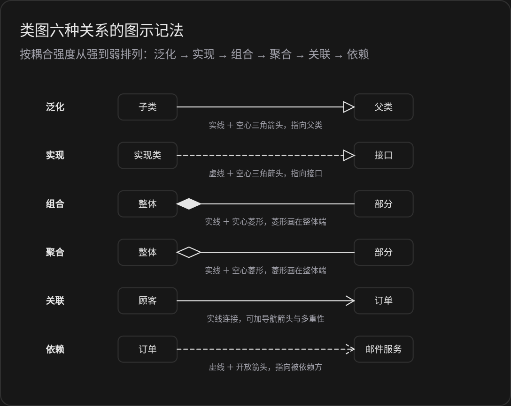

## UML 使用的图

UML 是统一建模语言。它是一套标准符号，用于对软件系统做可视化描述。

UML 定义了两类图：结构图和行为图。结构图描述系统的静态组成，行为图描述系统的动态过程。

### 结构图

结构图有七种。它们回答的问题是：**系统由什么组成，各部分之间有什么关系。**

**类图**
类图是使用最广的图。它描述系统中的类、类的属性和操作，以及类之间的关系。类用一个矩形表示，矩形分三段：名称段、属性段、操作段。类之间的关系有六种，按关系强度从强到弱依次为：泛化，表示继承关系，子类与父类绑定最深；实现，表示类对接口契约的履行；组合，表示整体与部分的强绑定，部分随整体消亡；聚合，表示整体与部分的松散组合，部分可独立存在；关联，表示对象之间的连接；依赖，表示一个类临时使用另一个类。其中聚合和组合是关联的特殊形式。类图用于设计阶段的静态建模，是代码结构的直接依据。

**对象图**
对象图是类图的一个实例快照。它展示某一时刻系统中实际存在的对象及其属性值。每个对象标注为“对象名：类名”的形式。对象图用于验证类图的正确性，特别是复杂关系的场景。

**组件图**
组件图描述系统的物理组成单元，即组件。组件是可独立部署、可替换的模块，如一个库、一个服务、一个可执行文件。组件图展示组件之间的依赖和接口，一个组件通过接口提供服务，另一个组件通过接口使用服务。组件图用于系统的模块划分和部署规划。

**部署图**
部署图描述软件到硬件的映射。它展示计算结点、结点上运行的组件、以及结点之间的通信路径。部署图用于系统上线前的容量规划和环境设计。

**包图**
包图描述系统的分组结构。包是模型元素的容器，如类的集合、用例的集合。包图展示包之间的依赖关系，用于控制系统的层次和耦合。

**组合结构图**
组合结构图描述一个类的内部构成。它展示类的内部部件、部件之间的连接、以及类对外提供的接口和需要的接口。它比类图更细，用于描述复杂对象的内部协作方式。

**剖面图**描述对 UML 的扩展（构造型、标记值、约束），日常设计不常用，此处不展开。

### 行为图

行为图有七种，分两组：通用行为图三种，交互图四种。它们回答的问题是：系统做什么，各元素如何协作。

**用例图**
用例图描述系统对外的功能视图。它包含三种元素：参与者，即与系统交互的用户或外部系统；用例，即系统提供的一项完整功能；关系，即参与者与用例之间的关联，以及用例之间的包含和扩展关系。用例图用于需求分析阶段，描述系统边界和功能范围。

**活动图**
活动图描述一个过程的执行流程。它展示活动、活动之间的转移、判定分支、并发分叉与汇合。活动图类似流程图，但增加了并行的表达能力。它用于描述业务流程、算法过程或单个用例的内部流程。

**状态机图**
状态机图描述一个对象在生命周期中的状态变化。它展示状态、状态之间的转移、触发转移的事件、以及转移发生时的动作。状态是对象在一段持续时间内满足的条件。状态机图用于描述行为受事件驱动的对象，如订单、会话、设备控制器。

**序列图**
序列图描述对象之间按时间顺序排列的消息交互。它从上到下表示时间推进，从左到右排列参与交互的对象。每个对象有一条生命线，生命线之间的箭头表示消息，箭头方向即消息发送方向。序列图用于描述一个具体场景的交互细节，如一次请求的完整处理过程。

**通信图**
通信图与序列图表达相同的信息，即对象之间的消息交互。差别在布局：通信图不强调时间轴，而强调对象之间的链接结构。消息用编号标出顺序。通信图适合展示交互对象的整体拓扑。

**定时图**
定时图强调交互的时间约束。它沿时间轴展示每个对象的状态变化和消息持续时长，用于实时系统或对时间敏感的过程。

**交互概览图**
交互概览图是活动图与交互图的组合。它以活动图为骨架，每个活动节点可以是一张完整的序列图或通信图。它用于概览多个交互场景之间的流程关系。

### 图的选择方法

建模时按目的选图：

- 分析需求时，用用例图描述功能范围。
- 梳理流程时，用活动图描述业务过程。
- 描述对象生命周期时，用状态机图。
- 描述一次交互的细节时，用序列图。
- 设计系统结构时，用类图描述逻辑结构。
- 划分模块时，用组件图和包图。
- 规划上线环境时，用部署图。
- 描述复杂对象内部结构时，用组合结构图。

### 使用原则

- 一个图只表达一个主题。信息过多的图会降低可读性。
- 图的详细程度与用途匹配。给需求方看的图保持简洁，给开发人员看的图可加细节。
- 不要试图用一张图覆盖全部系统。按模块、按层次分图。
- 结构图和行为图配合使用。结构图定骨架，行为图定过程，两者相互印证。
- 图与代码保持同步。图与实际实现脱节时，图失去价值，应更新或删除。

### 常见错误

- 在类图中混淆聚合与组合。聚合中部分可独立存在，组合中部分随整体消亡。
- 在序列图中省略消息方向或返回值，导致交互过程不明确。
- 用活动图描述对象的状态变化。此场景应使用状态机图。
- 在用例图中把系统内部步骤画成用例。用例必须对参与者产生可见的结果。
- 只画结构图不画行为图，或反之。两类图互补，缺一侧模型不完整。

### 小结

UML 的图分两大类，共十四种。

结构图有类图、对象图、组件图、部署图、包图、组合结构图等七种，描述系统的静态组成。

行为图有用例图、活动图、状态机图、序列图、通信图、定时图、交互概览图七种，描述系统的动态过程。

日常开发中最常用的五种是：类图、用例图、序列图、活动图、状态机图。

选图的依据是建模目的：结构问题选结构图，过程问题选行为图。
